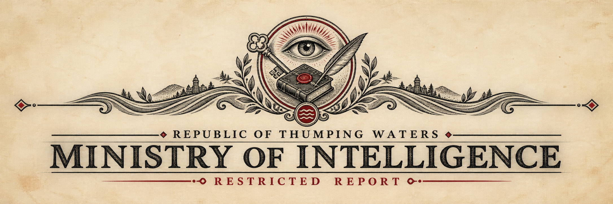

# Wild Hunt Council Briefing

## Council Intelligence Briefing

**Subject:** [Wild Hunt](Wild%20Hunt.md) Activity and Deteriorating Fey Relations

**Prepared by:** [Linzi](../../NPCs/Linzi.md), Minister of Communication

**Distribution:** Prime Minister and Council of [Thumping Waters](../../../../Locations/Inner%20Sea%20Region/River%20Kingdoms/Stolen%20Lands/Thumping%20Waters/Thumping%20Waters.md)

**Classification:** Council Eyes Only

### Summary Judgment

Wild Hunt scouts have crossed into the [Stolen Lands](../../../../Locations/Inner%20Sea%20Region/River%20Kingdoms/Stolen%20Lands/Stolen%20Lands.md) on at least two confirmed occasions. Their statements indicate preparation for a larger Hunt, but we possess no confirmed date, leader, route, or target. A warning delivered by the leshy calling himself Lurk claims that the Hunt is imminent and that the seal beneath [Candlemere](../../../../Locations/Inner%20Sea%20Region/River%20Kingdoms/Stolen%20Lands/Greenbelt/Kamelands/Lake%20Candlemere.md) is failing. Neither claim has been independently confirmed.

The more immediate danger may be political rather than military. Since the western uplands incident, fey throughout the Republic appear to be withdrawing the informal warnings, aid, and tolerance upon which many frontier communities have unknowingly relied.

### Earlier Confirmed Contact

Near [Pitax](../../../../Locations/Inner%20Sea%20Region/River%20Kingdoms/Stolen%20Lands/Thumping%20Waters/Settlements/Pitax/Pitax.md), the Tubthumpers encountered a Wild Hunt archer identifying herself as Jeffrie and one accompanying hound. The pair said they had crossed from the First World to practice for a Hunt and described mortals as its intended quarry. They did not identify its leader or date.

After a serious battle, the fey requested parley, assessed the party as worthy future prey, and withdrew. This encounter demonstrates that individual Hunt members may negotiate and that they distinguish between immediate opponents and quarry reserved for a later chase.

### The Western Uplands Incident

During the winter survey, the ministers entered an unnaturally warm and flowering glade occupied by a second fey hunter and two supernatural hounds. The hunter stated that they were preparing the land for the Wild Hunt and described the ministers as prospective prey.

[Seamus](../../Characters/Seamus.md) challenged her to prove that the ministers were less formidable than she believed. Combat followed. Both hounds yielded. The hunter subsequently offered her own surrender after suffering further injuries.

Prime Minister [Ally Grainger](../../Characters/Ally%20Grainger.md), badly wounded and believing the surrender might be a deception, attacked after it was offered. The hunter and both hounds escaped. Before departing, they promised to tell other fey that the rulers of Thumping Waters do not honor surrender and declared that no fey would offer the ministers mercy again.

The threat was not idle. Reports collected since the encounter indicate a broad change in fey behavior. The pattern is not one of organized attack, but of withheld assistance, rejected restitution, and indifference toward mortals in danger.

*See supplemental report: []*

### Lurk's Warning

The leshy identifying himself as Lurk entered the council chamber in the form of a hawk before revealing his natural shape. He described himself as a guardian of the Stolen Lands and warned that the Wild Hunt is coming.

Lurk also claimed that the seal beneath Candlemere is breaking and that the Republic must repair it and stand together or be destroyed when the Hunt arrives. He provided no evidence sufficient to verify the condition of the seal. His warning is consistent with other evidence of increased Wild Hunt activity, but consistency is not confirmation.

No public statement should describe the seal as failing unless investigators establish that fact independently.

### Assessment

The Wild Hunt appears to value challenge, ritual, and the designation of worthy quarry. This may create opportunities for negotiation, but it also makes careless boasting exceptionally dangerous. No minister should issue, accept, or improvise a challenge involving the Hunt without council agreement.

The western hunter's accusation may now shape the behavior of fey who have no formal connection to the Hunt. If so, defeating Hunt scouts will not repair the damage. The Republic must demonstrate through consistent conduct that its bargains, truces, and surrenders can be trusted.

The relationship between the Wild Hunt and the structure beneath Candlemere remains unknown. It is possible that Lurk connected two genuine but separate dangers. It is also possible that activity surrounding one is affecting the other. Planning should consider the connection plausible without treating it as established.

### Recommended Actions

- Send a discreet research party to examine the Candlemere seal without opening, dispelling, or damaging it.

- Seek consultation with Melianse, Evindra, and other fey or First World experts willing to speak with the Republic.

- Ask [Jubilost Narthropple](../../NPCs/Jubilost%20Narthropple.md) and [Roald Celinnas](../../NPCs/Roald%20Celinnas.md) to compare regional Hunt traditions for repeated rules, weaknesses, and warning signs.

- Equip frontier watch posts with cold iron and establish a rapid signal for reports of horns, unnatural fog, spectral hounds, or unseasonable growth.

- Prepare shelter and evacuation plans without announcing that an attack is certain.

- Instruct ministers, officers, and negotiators that challenges, names, promises, truces, and surrender may carry binding significance in dealings with powerful fey.

- Continue collecting reports of changed fey behavior and distinguish verified incidents from rumor.

### Public Position

The public may be told that Wild Hunt scouts have been observed and that sensible precautions are underway. The western surrender incident, Lurk's identity, the Candlemere claim, and the apparent withdrawal of fey mercy should remain restricted until disclosure serves a clear purpose.

The Hunt has not been confirmed within our settlements. The seal has not been confirmed to be failing. We should prepare for both possibilities without turning either possibility into fact through repetition.

—Linzi, Minister of Communication
