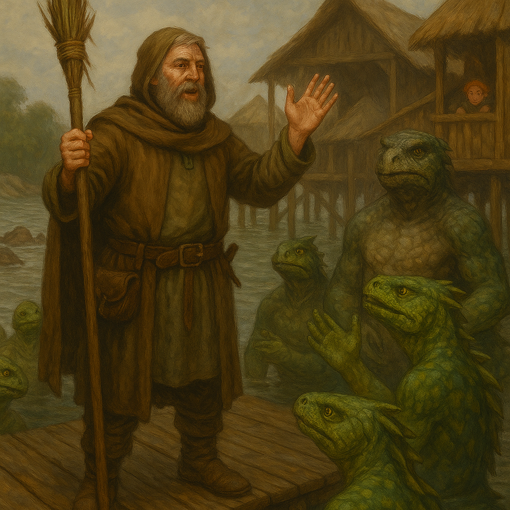

# Hanspur's Chosen

> [!side]
> :   

As Boris Petrinski stands upon the wooden docks of Longtail Island, he quickly realizes that most of his audience is not human. The Iruxi, the island’s lizardfolk inhabitants, watch him with cold, unblinking eyes, their scaled forms gleaming in the humid air. Some crouch in the shallows, their tails flicking idly in the brackish water, while others perch atop wooden walkways and stilted huts, listening in silence.

Boris clears his throat. The ways of the river are old, but these people know the tides and currents far better than most land-dwellers. He raises his staff, its end wrapped in river reeds.

"Children of the water! You, who know the currents and the ebb of life itself, hear me! I am Boris, servant of Hanspur, who walks where the rivers run wild and the waters shape the land! He calls upon all who embrace the journey, who trust in the river’s wisdom, and who move ever forward!"

A deep-chested Iruxi elder, his scales a mottled gray-green, clicks his throat. "The river is known to us, wanderer. We were shaped by it long before your god had a name. Why should we heed your words?"

Boris nods respectfully. He knew he would not impress these people with mere words alone. He steps to the water’s edge, letting the murky tide lap at his boots.

"The river is wise, yes, and ancient. It carves the world, shapes the shore, feeds the many. But do you not see? Even in its wisdom, it is never still. Those who refuse to move with the current are left behind, stranded on the banks of old ways. Hanspur does not demand fealty—only understanding. He teaches that to journey is to live!"

The Iruxi exchange glances, their vertical pupils narrowing in thought. Some nod approvingly—after all, their ancestors have long followed the flow of tides and rivers, moving where the water leads. Others remain skeptical.

"You speak of movement, traveler," one young hunter calls. "But we are not human. We do not drift aimlessly. We follow the currents because we know their ways. Does your god?"

Boris chuckles. "Hanspur is the current. He knows the dangers of the deep, the pull of the unseen tide, and the way a river must carve its own path. He does not force you to float. He calls you to swim."

The elder rumbles with amusement. "Perhaps you should prove it, then."

A hush falls over the gathered Iruxi. One of the younger warriors smirks and gestures to the river’s mouth, where the waters churn around jagged stones. A traditional trial of strength and faith—if this human truly trusts the current, let him place his fate in it.

Boris grins. "Hanspur guides. The river tests. Very well—let the water decide!"

And with that, he steps forward, unfastening his cloak and handing his staff to a bemused Iruxi, before plunging headfirst into the river’s embrace.

