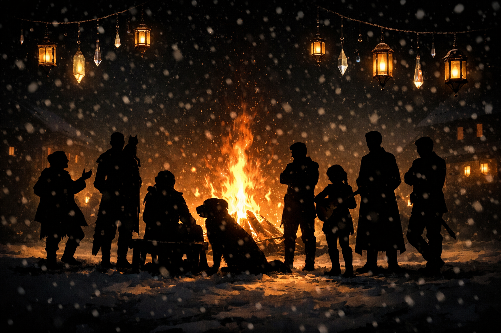

# Rainbows in the Snow

The winter solstice came down gently that year, like the world had decided to exhale all at once.

Thumpington shimmered. Crystal prisms and glass baubles hung from every eave and arch, catching lantern-light and throwing it back as fractured rainbows that skittered across packed snow and stone. The effect was mildly impractical and profoundly effective—no one could walk ten steps without color brushing their boots or faces. It felt like the town had dressed itself in defiance.

By dusk, the rulers of Thumping Waters had drifted together near the great bonfire in the square, drawn by heat, food, and the rare luxury of an evening without agenda.

Ally stood with Euan near the fire, Misty balanced on her shoulder like a skeptical epaulet. Ant was mid-story, hands wide, voice louder than necessary.

*“—and then the door fell off, which I maintain was not my fault.”*

Jubilost snorted into his cup. *“If a door detaches under light pressure, that’s a design failure. Possibly treason.”*

Matteo sighed. *“I am begging all of you to stop redefining treason.”*

Fitzroy allowed himself a small smile at that, immaculate even in patchwork, his gaze drifting briefly toward the fire’s edge. Mairi sat there on a low bench, Connal sprawled at her boots like a contented bear rug. Lorcan hovered nearby, arms folded, alert but at ease.

Linzi dropped down beside Mairi with no warning. *“I’ve counted three engagements, two reconciliations, and one extremely ill-advised poem so far.”*

Mairi chuckled. *“Only one?”*

*“Give it time,”* Linzi said cheerfully. *“The night is young and people are sentimental.”*

Seamus passed close then, the Zonzon doll tucked carefully under his arm. A townsman stopped him, murmured something quick and earnest into the doll’s stitched ear, and pressed a small carved charm into its hand.

Seamus nodded once. *“Shelyn hears kindness spoken aloud.”*

Tristian stood a little apart from the bonfire, watching the light fracture and reform. Ally joined him for a moment, both of them facing the crowd.

*“It’s beautiful,”* Ally said.

Tristian inclined his head. *“Light often is, when people choose to share it.”*

When the time came, Seamus gathered the Zonzon doll and passed it to the chosen child. The square hushed—not forced, just attentive. Lanterns bobbed as the child carried the doll to the river’s edge.

Mairi leaned down, resting a hand briefly on Connal’s head. *“Easy,”* she murmured. The dog thumped his tail anyway.

The doll was set afloat. Red thread stark against black water. The current took it without comment.

The hush broke naturally. Music rose. Linzi sang, voice bright and sure.

Ant attempted to dance. Matteo winced. Fitzroy clapped once, firm and approving.

Jubilost gestured with his cup toward the bonfire. *“I will concede this,”* he said loudly. *“Communal meals do improve morale. Marginally.”*

*“That’s the nicest thing you’ve said all night,”* Ally replied.

Misty chose that moment to swat at a dangling prism and nearly toppled. Euan steadied her with a practiced hand.

No speeches followed. No declarations. No sense of endings.

Crystalhue was for light held briefly against the dark, for beauty made together and let go again.

And that night, beneath scattered rainbows and borrowed warmth, Thumping Waters was simply—and completely—at peace.

## General Details

##### From the Journal of Linzi, Minister of Communication

*On Crystalhue*

Crystalhue is the night when we all agree—quite stubbornly—that beauty is not optional.

It falls on the winter solstice, when the dark has done its worst and cannot reasonably be allowed to do any more. So we hang prisms and lanterns, we sing too loudly, we eat spiced food meant to remind us that warmth still exists, and we make small gifts with our own hands to say the things pride kept us from saying earlier in the year.

The Shelynites say it’s about love, art, and reconciliation. They’re right, of course, but they leave out the most important part: Crystalhue is about choosing light even when it would be easier not to. And once a year, the whole town chooses together.

---
