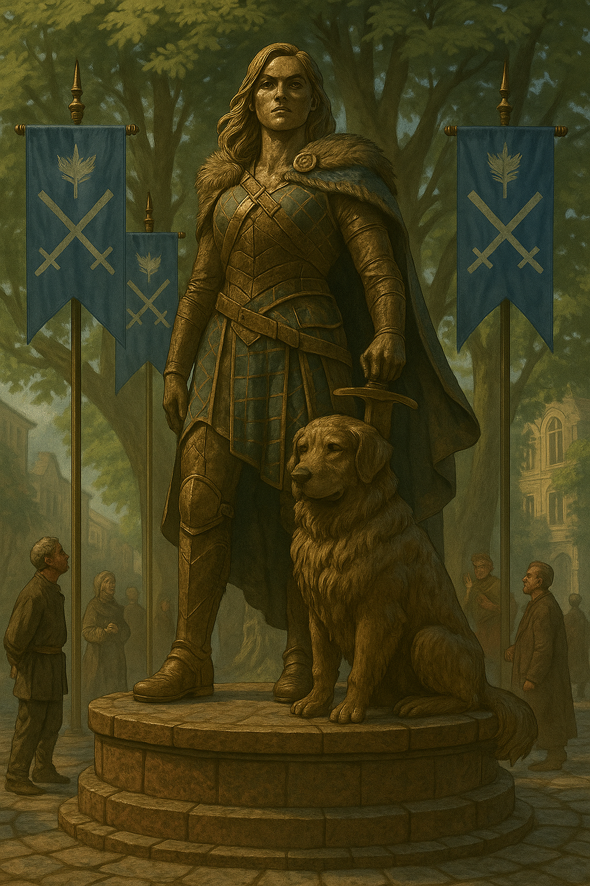

# The Day She Stood Still

> [!side]
> :   

##### From the Chronicles of the Republic of Thumping Waters

*The Dedication of the Monument to Mairi and Connal*
  

The unveiling took place beneath the old lindens in Thumpington Square, where the light filters through the leaves like blessings and the banners of Thumping Waters hung still in the morning air. The crowd stretched from the fountain to the edge of the market—soldiers in their finest, merchants on their tiptoes, children sitting on shoulders, everyone waiting for the moment when the veil would fall. For once, the capital was silent—not the tense silence before a battle, but the kind that feels like a heartbeat shared by thousands.

  

When the cloth came down, the air changed. **Mairi Blackwood** stood there in bronze, proud and unyielding, one hand resting on the pommel of her sword, the other loose at her side. Her expression wasn’t triumph—it was steadiness, that rare kind of peace that comes only after you’ve done what you had to, no matter the cost. Beside her sat **Connal**, the great wolfhound, head lifted, eyes fixed on the horizon. The sculptor caught him perfectly—strong, loyal, patient. You half expect him to step down from the plinth and circle the fountain before settling again at her heel.

  

No one cheered at first. The hush that followed felt heavier than any sermon. Because she’s not gone—not dead, not lost. Just gone farther. She left the Republic to carry the cursed sword to Sevenarches, to see a burden finished that no one else could lift. The statue isn’t a farewell. It’s a reminder that she’s still part of this place—hammer and hound, queen without a throne, heart of a kingdom still beating in rhythm with her steps somewhere beyond the border.

  

The speeches came, as they always do. Velka spoke first—short, solemn, and perfectly balanced between blessing and warning. Fitzroy followed, all duty and fire. Ally tried to make everyone laugh, then accidentally made half the crowd cry instead. And then there was **Seamus**. I wasn’t sure he’d even show. He’s been... different since she left—quieter, as though someone turned the volume of his soul down to a whisper. When he stepped up to the podium, he didn’t read a speech. He just looked up at the statue, voice rough, and said, “She told me once that courage isn’t the absence of fear. It’s being afraid and going anyway. I guess she went.” Then he stepped back, and no one clapped for a long time, because they were all too busy pretending not to cry.

  

Later, after the torches were lit and the crowd drifted home, I saw him again. He stood alone by the fountain, looking up at her in the flickering light. He reached out and touched the base of the plinth where Connal’s paw rested, then whispered something I couldn’t hear. When he turned to leave, there was a steadiness in his step that hadn’t been there before. Maybe that was her gift to him—one last lesson in how to keep walking when the road turns dark.

  

By morning, someone had placed a small whistle carved from river oak at the statue’s base. I like to think it was Seamus. It seemed fitting—a reminder that even the quiet ones carry the music forward when the bard falls silent.

