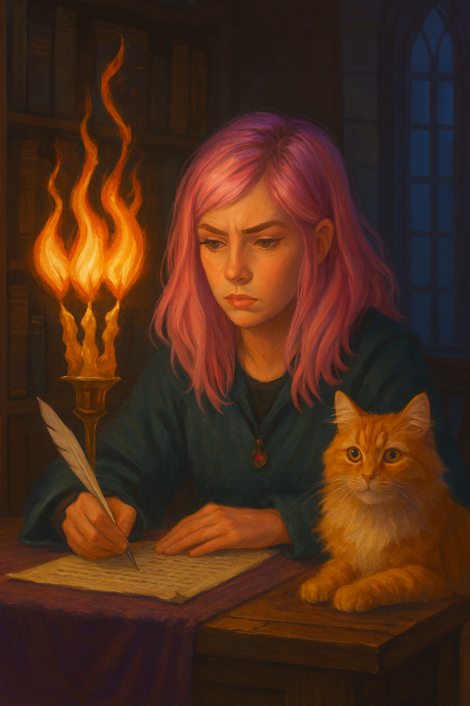

# The Flickering Flame

> [!side]
> :   

One night in her tower, Ally sat at her desk with parchment spread before her, shaping a lesson plan for her small circle of students. Her pink hair caught the glow of the candle at her side, its light shimmering faintly in the quiet of the study. Misty, her orange-furred companion, perched on the desk nearby, watching with unblinking curiosity.

The candle should have burned steady. Instead, the flame twisted tall, then split into three distinct tongues of fire. They swayed in unison like dancers on a stage, casting playful shadows across her notes as if mocking the careful order she worked so hard to maintain.

Ally frowned and blew the candle out. The flames guttered, but the darkness was not silent. As the smoke curled upward into the air, a whisper slipped into the room—soft, sly, and impossible to place:

"Smile."

