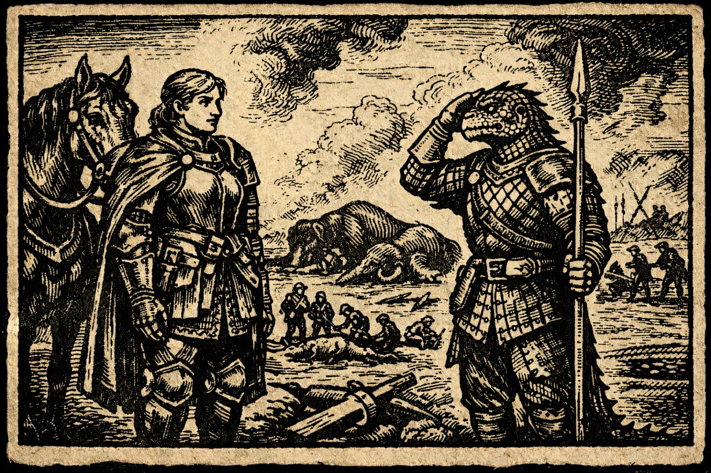

# The Quiet After Battle

> [!side]
> :   

The smoke had thinned by the time High Marshal Valerie rode across the fields outside Willowfen.

The ground was torn and blackened where the armies had met. Broken wagons, shattered lances, and churned mud marked the path of the mammoths’ charge. The great beasts themselves lay scattered across the valley like fallen hills.

Soldiers moved quietly through the aftermath.

Clerics knelt beside the wounded. Engineers argued over the best way to drag a mammoth carcass out of the road. Goblins from Nok-Nok’s Irregulars climbed across one of the giants, loudly debating which of them had actually been responsible for blowing it apart.

Valerie dismounted near a line of injured lizardfolk. Their shields were stacked neatly beside them, their spears planted upright in the soil.

One of them, his scales bandaged and one arm splinted, straightened when he saw her and gave a salute.

Valerie returned it without hesitation.

“Your people held the center.”

The lizardfolk warrior flicked his tongue once and nodded.

“The republic holds.”

Valerie turned her gaze back toward the battlefield. The wind carried the smell of smoke and wet earth across the valley.

“Send word to Thumpington,” she said quietly to the messenger at her side. “Tell them Willowfen stands.”

The messenger hesitated. “Anything else, Marshal?”

Valerie looked out over the dead mammoths, the shattered giants, and the soldiers still tending the wounded.

**“Yes,” she said. “Tell them the war has begun.”**

