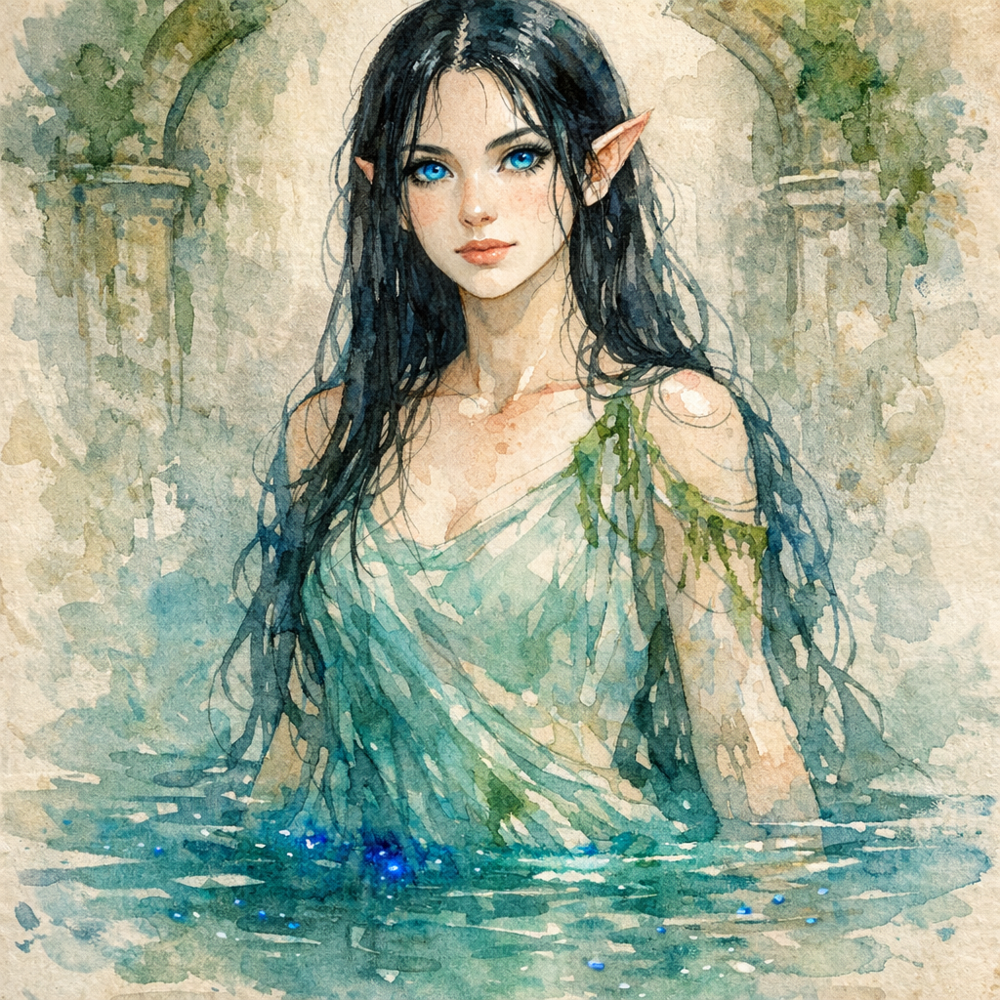

# The Stillness Beneath Whiterose

> [!side]
> :   

Evindra did not speak at first. Even freed, she lingered close to the water—touching it, shaping it, as if testing that it would not close around her again. When she finally began, her voice was low and steady, but not calm. “It was a good place,” she said, with quiet certainty. “The priests were not perfect—few mortals are—but they were kind. They knew enough to respect what they did not understand. They came to me only when they must, once each year when their brewing began. We shared knowledge, nothing more. It was… balanced. I chose to reveal myself to them. That was my decision.”

Her fingers traced slow circles along the surface of a small pool. “Then the fey came. He brought the blade.” Her eyes flicked up briefly. “A beautiful thing. Dangerous, in the way such things often are. He told me it needed to be hidden—that it was cursed, that it would bring ruin if left in mortal hands. I believed him. I hid it. Kept it safe. Said nothing to the priests. I told myself it was for their protection.” The water stilled. “It was not long after that Barlin arrived—a halfling with clever hands and restless eyes. He knew how to make things grow. That is how he earned their trust. But he did not know how to leave things alone. They told him about me. They thought it would help him. It did not.”

Her expression tightened, just slightly. “He became fixated. Not on the place. Not on the work. On me. On having me. He took my shawl while I slept. Without it, I am… diminished. Bound more closely to the water. Easier to compel. He knew that, or learned it quickly enough. He forced me into a shape that could be contained and bound me into that device you found. A clever prison. Simple. Effective.” She paused, gaze distant. “I could not see what followed. Not clearly. But I could feel it. The blade… woke when he touched it. It does not speak as mortals do. It does not need to. It presses. It suggests. It finds the fractures already present and widens them. Barlin did not become something new. He became more of what he already was.”

“They died quickly,” she said, and there was something almost merciful in the way she said it. “Most of them. He grew jealous. Suspicious. Certain the others meant to take what was his. And he acted on that certainty. Then he remained—alone, with the blade, and with me. For years.” The word lingered. “I do not know what he told himself in the end. Whether he believed he was protecting something, or simply keeping it. It no longer matters.”

“When the men from Pitax came, they were not subtle. But they were effective. They killed him, took the blade, and stripped the place of anything they thought valuable. My shawl among it. They did not find me.” She looked at the party then, fully. “You did. You have my thanks for that—more than you know.” A small breath. “The blade they took is not meant to lie forgotten in a hoard. It changes those who carry it. For good or ill… that depends on the hand.”

Her gaze lingered, measuring. “If you seek my shawl, you will find the blade along the same path. The men who took them serve a king who values such things.” She did not name him. “I will not pretend this is a small task. But I will not send you without aid.” The water beside her stirred, clear and luminous. “I can mend wounds. Ease burdens. And if you prove willing to see this through, there are other things I may teach.”

A final pause, quieter now. “But what I know of the blade’s deeper nature—of why it matters—that I will keep until my shawl is returned.”

*Recorded from Evindra’s account following her liberation from the water clock beneath Whiterose Hill.*

