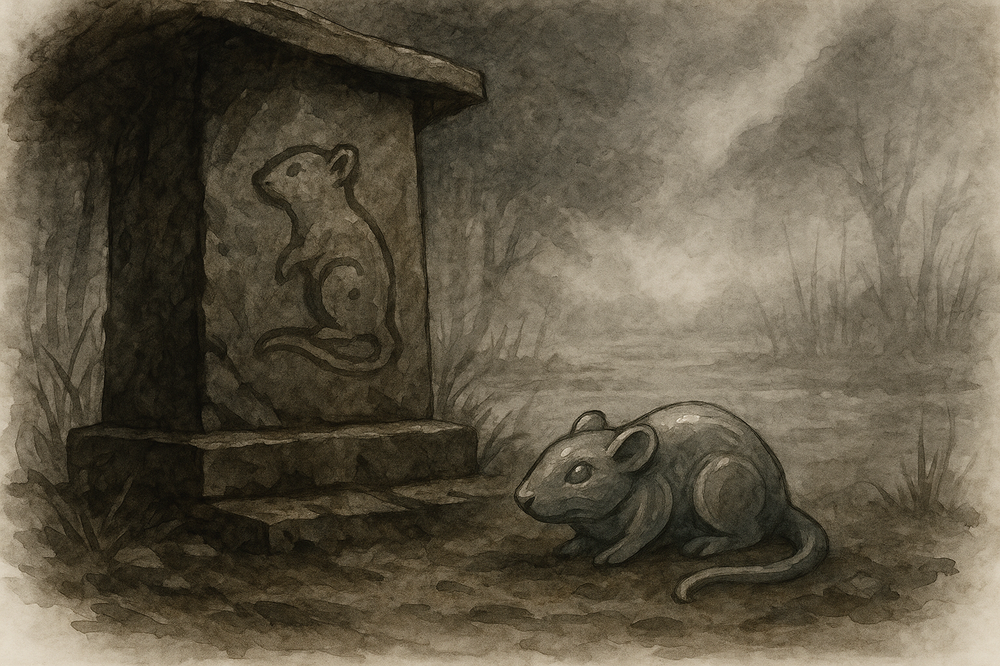

# The Stone Rat

#### The Stone Rat

  

The shrine sat where the marsh surrendered its grip for a moment, a scrap of high ground the river hadn’t bullied under. The stone had been there long before the settlement took root—a rounded block of river rock, streaked with silt and old patience. Someone, a few years ago or maybe a lifetime, had scratched the outline of a rat into one side. The carving wasn’t skilled, but it was honest, and that was usually enough for [Hanspur](../../../../Rules/Deities/Hanspur.md).

  

When the town rose around it—hastily, ambitiously, with more lumber than wisdom—no one dared move the stone. They simply built their warehouses around it, leaving a lean-to roof overhead so the rain wouldn’t wash it bald. The priests ignored it, the officials forgot it, and the people, quietly, acknowledged it in passing. A glance. A muttered word. A crust of bread left behind without much thought.

  

After the tyrant fell, the town felt hollow in the way a body feels after a fever breaks—lighter, but not yet steady. Folk spoke softly. Steps slowed. No one went looking for portents.

  

Except one woman, though she wouldn’t have called it that.

  

She was a laundress, thin and bent from years of work, the sort of person who blended into scenery until something forced you to look. Every morning she passed the shrine on her way to the river. And one dawn, before the sun burned the fog off the marsh, she paused.

  

From her apron she drew a little carving—a driftwood rat she’d been shaping in spare moments. It was lopsided and soft-edged, a creature rendered in hopeful guesses rather than knowledge. She set it carefully at the base of the old stone. No bow, no whisper. Words felt too heavy for the river.

  

The fog thickened overnight. It clung to the warehouses, muffled the gulls, made the whole town seem half-drowned in silence.

  

When she returned at first light, basket of wet linens balanced on one hip, she almost walked past the shrine without noticing.

  

The driftwood rat was gone.

  

In its place rested a stone rat the size of her fist—smooth as water-worn gravel, shaped with a precision she had no name for. Its curves resembled currents frozen in mid-turn. Its eyes were dimples just deep enough to catch the dawn. Moisture clung to it though the air was dry. When she brushed it with her fingertips, warmth pulsed faintly beneath the stone.

  

She looked around, expecting a prankster or a neighbor or even a stray dog to give away the trick. But the world was empty of witnesses. The warehouses loomed unchanged. The river mumbled to itself. Nothing else had shifted.

  

She wrapped The Stone Rat in the corner of her shawl and took it home. Not out of fear. Out of the quiet certainty that this moment belonged only to her.

  

The next day, the town continued as if nothing had happened. People argued over fish prices. Children played in muddy alleys. Repairs began, slow and awkward, as life settled into its new shape. No gossip swirled, no whispers of miracles drifted through the docks.

  

Only one woman knew the river had answered something she hadn’t dared put into words.

  

At home, the stone rat sat on a shelf where the morning light found it. Sometimes she thought it glimmered faintly, as if remembering the marshwater that shaped it.

  

She didn’t leave another offering.

  

The river had spoken once. Asking again felt like presuming on a god’s patience—because anyone who lives near a marsh learns early that the river hears what it chooses, and once is already more attention than most people receive.

  

## General Details

##### From the Journal of Linzi, Minister of Communication

*On the Sudden Popularity of a Very Moody River God*
  

Fort Drelev—newly liberated, freshly sweeping up the emotional debris of tyranny—has begun to court the attentions of Hanspur, whether Hanspur likes it or not. And let’s be honest: river gods rarely “like” things so much as tolerate them with dramatic weather.

  

The townsfolk swear they aren’t becoming devout. They just… nod at the river more often. Or mutter a quick greeting when crossing the marsh. Or leave the occasional crust of bread on a windowsill facing the water. Not offerings, they insist. Just manners. River etiquette. It’s amazing what people decide counts as “not worship.”

  

Part of this is practical. Hanspur is the only one who consistently shows up in these parts—even if his “showing up” usually takes the form of floods, fog banks, or rats with opinions. But there’s something else, too. After years of bowing to a man who mistook cruelty for majesty, the people seem comforted by a god who makes no promises at all. Hanspur has never lied to them. He’s never pretended to be anything other than exactly what he is: unpredictable, blunt, and entirely himself.

  

There’s a strange sort of relief in that. You can’t disappoint a river. You can only survive it—or, if you’re very lucky, earn a moment of its indifference. And somehow that feels fairer than what they had before.

  

So the shrine gets swept now and then. Someone patched the lean-to roof. Children leave little tokens by the water, though they deny it with the ferocity of guilty saints. Worship? Never. Not them. They’re just being neighborly to the god who lives next door.

  

If this continues much longer, Fort Drelev may end up with the most polite congregation Hanspur has ever had. I’m not sure what he’ll do with it. Possibly flood something out of principle. But for now, the river watches, the people nod back, and peace—fragile, swamp-scented, a little damp around the edges—settles in.

---
