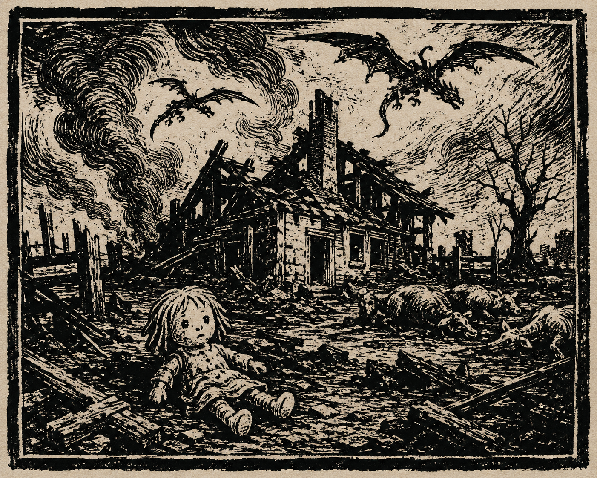

# The Town Irovetti Fed to Monsters

# THE TOWN IROVETTI FED TO MONSTERS

There are no bodies in Littletown.

That is what the Tubthumpers found when they reached the ruined settlement far to the west, deep in lands long held beneath the shadow of Pitax. Not graves. Not survivors. Not even bones. The homes still stand in places, blackened and split open to the sky. Tables remain set. Doors hang crooked from burned frames. Livestock rot where they fell in pens and fields. A child’s doll lies half-buried in ash beside the ruins of a farmhouse. The wells are cold. The streets are silent.

And overhead, the wyverns circled.

Only four people from the Republic have seen Littletown with their own eyes: Ally Granger, Ant, Seamus, and Vision Elowyn Vask of Razmir. They traveled west after reports that wyvern forces had gathered beneath the shadow of a massive cinder dragon. Rumors had already spread throughout the Stolen Lands that King Castruccio Irovetti had secured the loyalty of terrible draconic beasts for the coming war. Many dismissed those stories as frontier gossip.

No one who hears what was found in Littletown will dismiss them again.

The Tubthumpers did not discover a battlefield or a struggling frontier settlement. They found a town already dead. Drake swarms nested among collapsed homes. Claw marks scarred the streets and rooftops. The cinder dragon itself descended upon the expedition in a storm of ash and flame, attacking with the fury of a beast defending its claim over the ruins below. Whatever happened in Littletown ended weeks ago, perhaps longer. The monsters had not simply destroyed the settlement. They remained afterward, prowling through its streets while the rest of the world went unknowingly about its business.

And now the whispers begin.

*Littletown was sacrificed.*

*Its people. Its livestock. Its homes. Traded away in exchange for the service of monsters.*

Pitax denies nothing. Pitax explains nothing. Because what explanation could possibly justify what was found there? What kind of king allows an entire town to vanish beneath dragonfire while wyverns circle overhead for weeks afterward? What kind of ruler bargains away human lives to strengthen his armies?

The rulers of Thumping Waters have faced trolls, undead horrors, barbarian warbands, ancient curses, and the savage depths of the Hooktongue itself. Yet those close to the expedition say Littletown affected them differently. Since returning east, the Tubthumpers have spoken of the ruined settlement only rarely and with visible unease. Whatever happened there was terrible enough to silence even seasoned adventurers.

Perhaps the worst horror is not the destruction itself, but how quietly it happened. Littletown did not fall yesterday. No refugees escaped east with warning. No cries for aid reached the Republic. The town simply vanished while kings plotted, armies gathered, and Pitax prepared for war.

The Tubthumpers drove the creatures from the ruins. Steel and magic brought down drakes and forced the cinder dragon from its grisly perch. But there was no victory waiting in Littletown—only ashes, silence, and the growing certainty that Castruccio Irovetti’s ambition has become something monstrous.

Remember Littletown.

Because kingdoms that feed their people to monsters never stop at one town.
