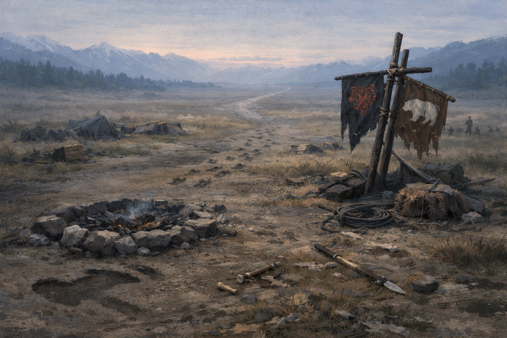

# Where Law Cannot Follow

> [!side]
> :   

The fire was kept low, more habit than necessity. Amiri had learned long ago that a bright flame drew attention, and attention had a way of turning into trouble. She sat with her back to a weathered stone, watching embers settle and shift, her hands resting idle in her lap. The place beside her—where a blade should have been—remained empty, and her gaze drifted there more often than she cared to admit.

The sword was still south.

That absence weighed on her more than steel ever had. The cursed blade had been forged for her, bound to her fate whether she wanted it or not, and then taken from her hands by someone she trusted enough to let it go. Mairi Blackwood had carried it willingly, knowing what it cost to do so, knowing that silencing it meant walking a road with no clear end. Amiri had never doubted her resolve. She doubted the world’s patience.

A Six Bear scout approached quietly, respectful but not afraid. “Still no word?” he asked, keeping his voice low.

Amiri shook her head. “Not yet. That road doesn’t end quickly.” She stared into the fire, remembering a woman with tired eyes and stubborn kindness, lifting a weapon that whispered lies and making it behave through sheer refusal to listen. “Mairi doesn’t quit halfway.”

The scout hesitated, then asked the question that had been circling the camps for days. “If she comes back… will things change?”

Amiri exhaled slowly. “If she comes back with the blade silenced,” she said, “then she will have done something no kingdom ever managed.” She looked north, where the land stretched wide and cold and unclaimed in the way only the Mammoth Lords’ realm could be. “That doesn’t mean the Republic will suddenly be safe for us.”

He frowned. “They mean well.”

“I know.” Her voice was calm, but firm. “That’s never been enough.”

Amiri rose, brushing ash from her hands, and glanced south once—toward walls, laws, councils, and a republic that had once felt like a promise she could stand inside. She had led there once. She had believed there once. And once, under Mairi Blackwood, that belief had almost been justified. But Mairi no longer held the reins, and Amiri had learned better than to tie her people’s future to whoever happened to sit in a chair next.

“At dawn, we move,” she said. “Tiger Lords and Six Bears together. One people. North, where no one asks us to pretend we belong.”

The scout nodded, understanding what wasn’t said. Debt did not require obedience. Loyalty did not require proximity. Some bonds were honored by leaving space for them to endure.

As the fire burned down to coals, Amiri allowed herself one final thought of the road Mairi walked alone, blade in hand, chasing silence through danger and memory. She did not know when that road would end—or if it would.

She would make sure that, when it did, there was still a home to return to.

