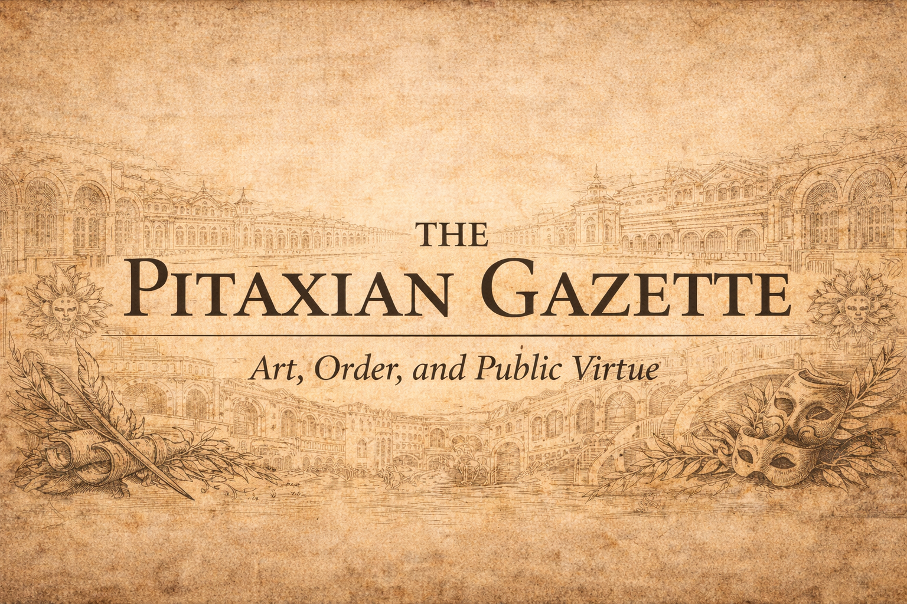

# Where is the King?

# Pitax Gazette

*Lamashan 24, 4714 AR*

# Where Is the King?

*By Our Staff*

Something feels different in Pitax.

Over the past several weeks, royal wardens have been observed removing pamphlets from walls and notice boards throughout the city, while reports of anti-royal graffiti continue to circulate despite repeated efforts to erase it. Performers have grown noticeably bolder in their public commentary, merchants speak of unusual disruptions to trade, and tavern conversations increasingly turn toward politics before abruptly ending whenever unfamiliar faces approach.

At the center of these rumors lies a simple question:

*Where is King Castruccio Irovetti?*

For most of his reign, His Majesty has maintained a highly visible public presence. Whether presiding over festivals, attending performances, judging competitions, or addressing matters of state, King Irovetti has rarely been absent from public life for long. Yet many citizens report seeing remarkably little of the king in recent weeks.

Official statements maintain that His Majesty remains occupied with matters of governance and the ongoing war effort. Such explanations are, of course, entirely plausible. Nevertheless, speculation continues to spread.

Some claim the king has withdrawn into the House of a Hundred Doors to oversee military preparations. Others insist the court has become increasingly secretive following recent setbacks along the frontier. A handful suggest the growing unrest within the city itself has demanded more attention than officials care to admit. Whatever the truth, uncertainty has become a topic of conversation in every district of the city.

One merchant interviewed by the Gazette described the atmosphere as “the feeling before a storm.” A theater patron offered a different comparison, describing the city as “an audience waiting for the curtain to rise.” Neither seemed particularly reassured by the analogy.

The Gazette makes no claim regarding the source of the pamphlets, graffiti, or persistent rumors now circulating throughout Pitax. We merely note that they continue to appear despite increasingly visible efforts to remove them.

For now, the city waits. The wardens watch. The pamphlets continue to circulate.

And somewhere beyond the walls of the House of a Hundred Doors, a king who once seemed impossible to ignore has become surprisingly difficult to find.
