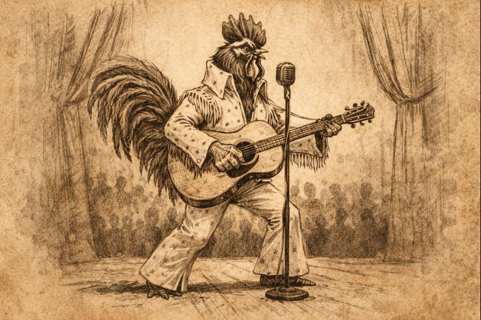

# The King Comes to Thumpington

### The Lantern and Ledger

*Light for the Present. Record for the Future.*
  

**Oathday, Desnus 12, 4714 AR**

*An Editorial by [Linzi](../../NPCs/Linzi.md), Minister of Communication*

It is not every month that [Thumpington](../../../../Locations/Inner%20Sea%20Region/River%20Kingdoms/Stolen%20Lands/Thumping%20Waters/Settlements/Thumpington/Thumpington.md) receives a visitor famous enough to make the dockhands pretend they were never impressed by anything in their lives. This month, however, the city hosted [Leroy](../../NPCs/Leroy.md)—known to most of Andoran simply as The King—an awakened rooster from Almas whose improbable rise from barnyard curiosity to national sensation has been unfolding for nearly two years.

Leroy arrived quietly, which is to say he arrived without banners, guards, or proclamations, and was recognized almost immediately anyway. Fame travels faster than caravans. His performances—advertised as limited and, pointedly, temporary—sold out within days. The crowds that gathered were a mix of local farmers, visiting merchants, and more than a few people who insisted they were “just curious” while humming his melodies under their breath.

For readers unfamiliar with his work, The King’s music draws heavily on rural traditions—field songs, work rhythms, old call-and-response tunes—but reshapes them through a style that is unmistakably modern. His guitar playing is sharp, confident, and unafraid of silence. His voice, while still recognizably avian, carries emotion with surprising precision. The effect is less novelty and more recognition: culture grows wherever people bother to tend it.

One evening’s performance included an unscheduled collaboration with [Seamus](../../Characters/Seamus.md), who joined Leroy on stage with a fife. What followed was not rehearsal but conversation—wood and string answering one another in a way that suggested neither instrument was particularly interested in hierarchy. The audience responded accordingly. There are reports of dancing. These reports are accurate.

Leroy closed the set with his most familiar piece, Sun Do Shine, a song whose Sarenrite overtones are subtle enough to invite rather than instruct. At its heart is a simple refrain—something to the effect of “the sun still rises, and so do we”—delivered not as doctrine, but as reassurance. It plays less like a sermon and more like a reminder shouted joyfully across a field.

It is worth noting that Leroy, at three years old, is fully grown and firmly adult by the standards of his kind. That awareness does not hang over his performances like a warning; instead, it sharpens them. He plays with the ease of someone who knows what he wants to say and the confidence of someone saying it at the right time. If there is urgency in his music, it is the good kind—the kind that asks you to listen now because now is available.

The King does not speak often between songs. When he does, he avoids prophecy and reassurance in equal measure. He lets the music do its work. In this, he has more in common with this publication than he may realize.

Leroy departed Thumpington as he arrived: without ceremony, and with the city subtly changed behind him. The docks are quieter now. A few tunes linger. Seamus has been heard practicing alone. The press records this visit not as spectacle, but as a moment well spent—proof that even brief visits can leave something lasting, especially when they arrive in the right light.
