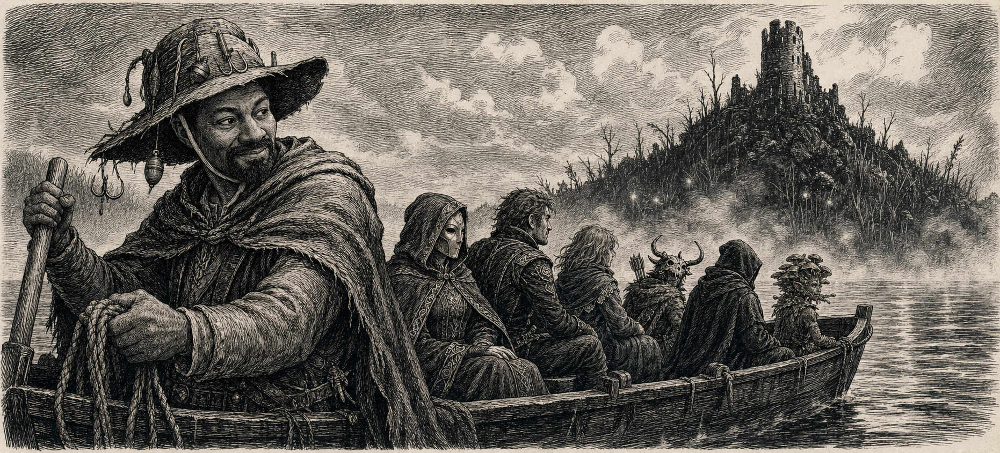
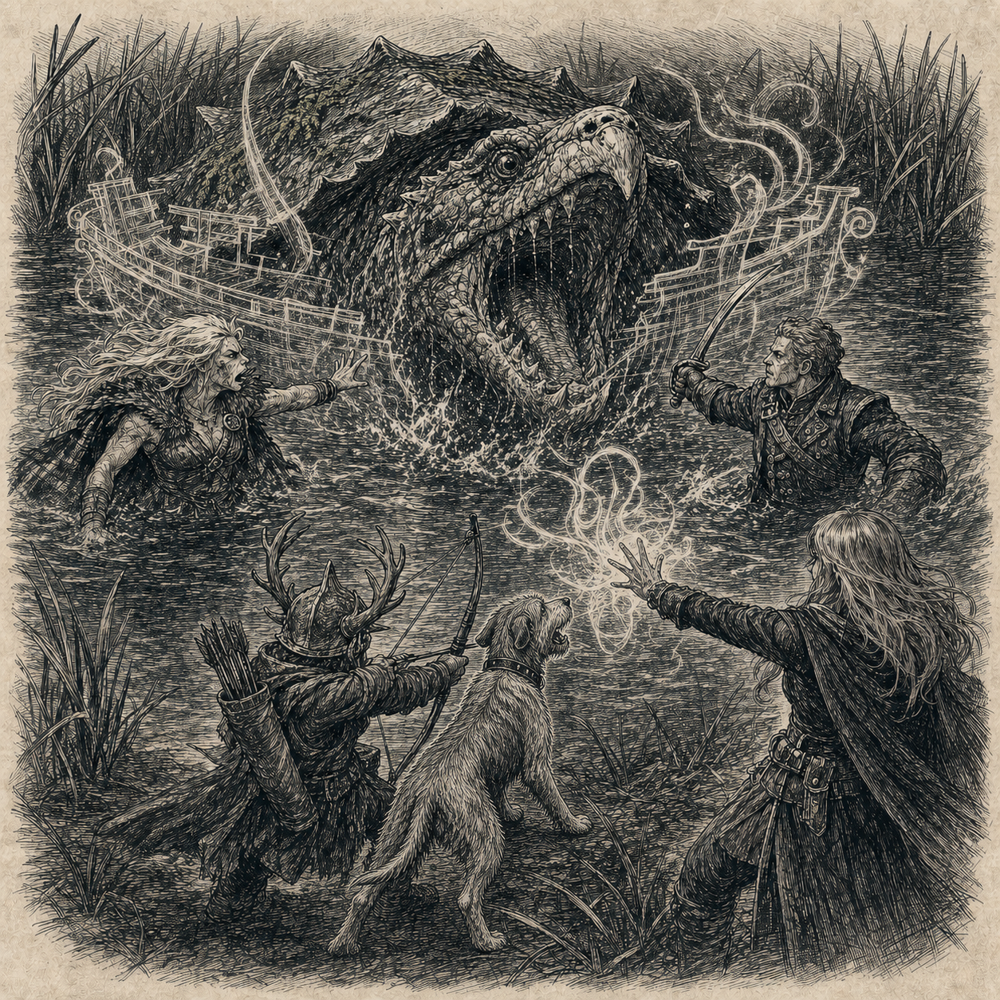

# The Water Owed Him One

### THE LANTERN AND LEDGER

*News, Notices, and the Public Record of Thumping Waters*

Abadius 20, 4716 AR • Published in Thumpington • Linzi, Editor • Mara Venn, Managing Editor • Price 1 cp

---

**FROM THE INSIDE PAGES**

## THE WATER OWED HIM ONE

*Before Candlemere, Arven and the Tubthumpers shared another dangerous stretch of water.*

*By Sella Copperclaw, Trade and Civic Affairs Correspondent • From interviews and the journals of Linzi, Minister of Communication*

---

Arven looked across Lake Candlemere for a long time before he answered.

The island was visible through the morning mist, though only barely. A dark hill. A broken tower. The sort of destination that makes a sensible boatman remember work awaiting him in the opposite direction.

*Arven carries the Tubthumpers toward Candlemere Island years after their first adventure together upon dangerous water.*

“You remember Old Crackjaw?” he asked.

The Tubthumpers remembered.

### A FISHING GROUND UNDER SIEGE

*Old Crackjaw rises through a boat that never existed. Connal stands with Ant and Ally upon the shore.*

It was 4710 AR, when Thumping Waters was young enough that its rulers carried more weapons than responsibilities—or at least fewer responsibilities than they carry now. Arven came to them after an enormous snapping turtle claimed one of his best fishing grounds. The creature had attacked his boat, damaged several others, and made a persuasive argument that the waters belonged to anything large enough to bite through the hulls of those who disagreed.

Arven wanted the turtle driven away.

The Tubthumpers killed it instead.

Arven did not accompany them. He showed them the threatened waters, explained what had happened to his boats, and left the dangerous portion to the adventurers he had hired.

Their plan began with an illusion of a fishing boat. Old Crackjaw surged upward through the phantom hull, snapping at timber that had never existed, and plunged back into the water when his jaws found nothing to break. That was when the plan became less clever and considerably wetter.

Mairi and Seamus entered the deep water to meet him. Antson Crazyfoot and Ally Grainger attacked from the bank while Connal barked at the enormous turtle from the shore. Old Crackjaw nearly killed Mairi. When wounded, he pulled himself into his shell and sank, forcing the Tubthumpers to finish the fight against a fortress that could swim.

They did finish it.

When the water stilled, Old Crackjaw lay dead, Arven had his fishing ground back, and the Tubthumpers had found an enchanted sickle along the shore. Arven gave them a returning rune in gratitude. It was not the largest reward they would ever earn, but in those days a safe place to fish and a promise kept both seemed like the foundations of something larger.

### THE SAME BOATMAN, DARKER WATER

Years later, Arven stood looking at Candlemere, where pale lights moved through the mist and old stories advised every boat to turn aside.

The Republic required a fisherman willing to carry its ministers to the island. More cautious boatmen had excellent reasons to decline.

Arven agreed.

“They went into the water for me when I asked,” he said. “I can put a boat under them now.”

And so the same fisherman who once asked four young adventurers to reclaim his stretch of water carried the rulers of a republic toward an island beneath which something ancient waited in the dark.

They were older. The dangers were larger. Their titles had grown almost as numerous as their scars.

Arven still knew better than to promise them a safe crossing.

He only promised to get them there.

---

The Lantern and Ledger • Inside Pages • Abadius 20 Edition • Printed in Thumpington
