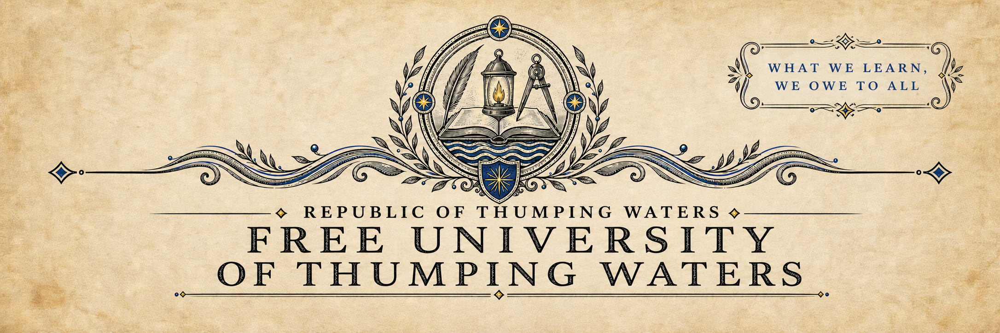
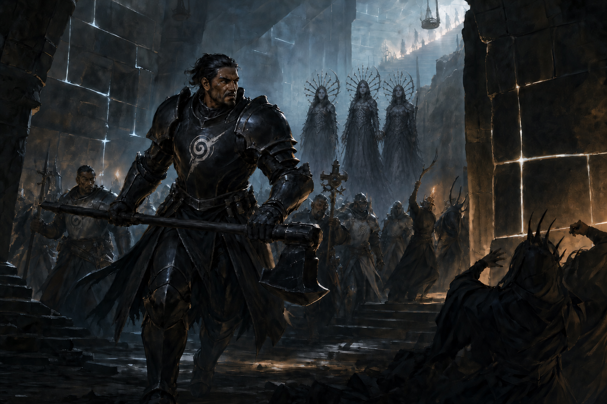
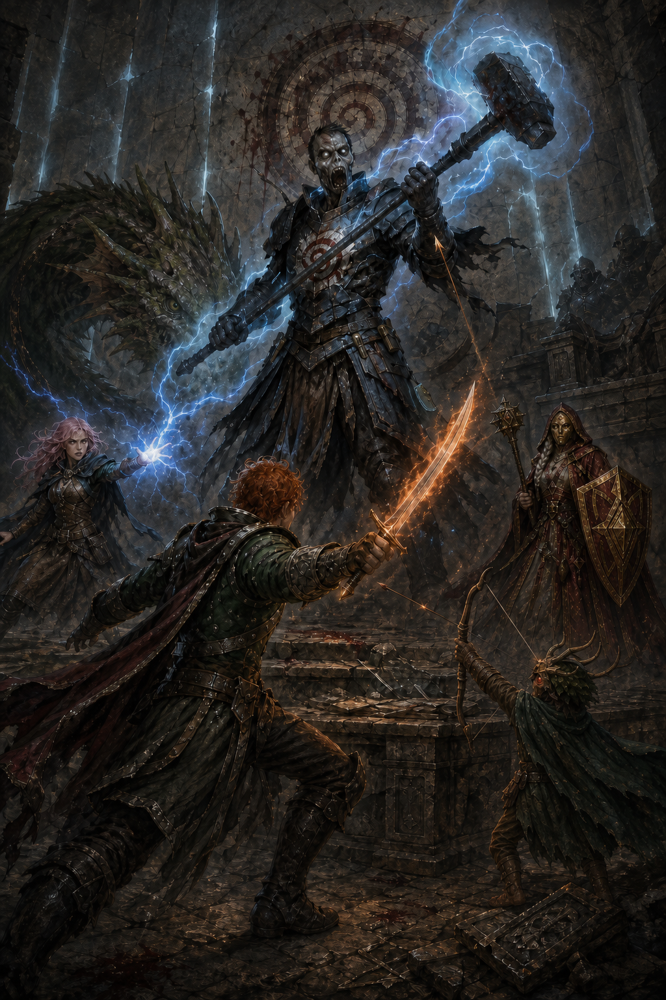

# The Last Guardian

## THE LAST GUARDIAN

*A narrative reconstruction of Korog's vigil beneath Candlemere*

Free University of Thumping Waters • Candlemere Studies Paper No. 1 • Provisional Public Edition, 4716 AR

---

### University Publication Note

**Principal Compiler:** Roald Celinnas, Contributing Archivist

**Publishing College:** College of Letters and Public Record

**Publication Type:** Narrative reconstruction

**Scholarly Review:** College of the Four Traditions

**Archival Assistance:** Ministry of Communication

**Status:** Provisional; subject to revision when the Candlemere expedition returns

This paper is the first public narrative reconstruction issued through the Free University's Candlemere Studies project. It was prepared by Roald Celinnas for the College of Letters and Public Record, with review by scholars of the College of the Four Traditions concerning Pharasmian doctrine, psychopomps, deliberate undeath, and the magical character of graveknight armor.

The broad history is supported by inscriptions beneath Candlemere, preliminary reports transmitted by the Tubthumpers, physical descriptions of the recovered chambers and armor, and testimony given by the Morrigna psychopomps Hastania, Oreshki, and Vatinitel. These sources support the existence of Korog, Foras, the Thresholders, the ancient Pharasmian assault, the Spiral Seal, the defenders' transformation into graveknights, and Korog's final confrontation with the modern expedition.

The precise relationship between Korog and Foras is treated as probable rather than fully confirmed. The available sources describe them as brothers, but the surviving record remains incomplete. The chronology of the ancient campaign, the motives assigned to individual participants, and the sequence by which Korog embraced undeath are supported interpretations rather than direct observations.

Korog left no journal known to the university. His private words, thoughts, memories, prayers, and final realizations are therefore conjectural. Dialogue not preserved in expedition reports or inscriptions has been composed for the reconstruction. It should not be cited as testimony.

*The distinction matters. A story may help us understand a dead man. It must not pretend that understanding is evidence.*

—Roald Celinnas, Contributing Archivist, College of Letters and Public Record

---

### Before the Stone Closed

Korog learned the truth about his brother beneath a tower that watched the stars.

Foras had always spoken as though the world concealed something from him. Every unanswered question was an insult. Every locked door had been built by a lesser mind to deny him what should already have been his. When people disappeared from the scattered Kellid settlements, Korog hunted the kidnappers expecting raiders, slavers, or some rival chieftain with more ambition than sense.

Instead, he found Foras.

His brother had dug a kingdom into the earth beneath Candlemere. In its chambers, the Thresholders watched impossible stars, carved prayers to the thing they called Yog-Sothoth, and bled captives so that Foras might master distance, death, and time. He promised his followers that he would open a gate to the secrets of the universe. He neglected to tell them that everyone else would be fed through it.

Korog had never been patient with argument. He answered his brother with an army.

*Korog leads the Pharasmian assault beneath Candlemere while the Spiral Seal is prepared above.*

The first advance was swift. The Thresholders nearest the surface had been given devotion but little power, and the furious servants of Pharasma drove them downward through their own halls. Korog fought at the front, a maul in his hands and the spiral of the Lady of Graves upon his armor. Behind him came Kellid warriors, priests, and three grim hunters from the Boneyard. Before him fled the servants of his brother.

Then the advance reached Foras's inner circle, and it stopped.

The passages were too narrow. The defenders did not tire. The dead did not remain properly dead. Every chamber taken cost more lives than the last, and every retreat left another body in the dark. Korog could not break through to his brother. He could not withdraw without allowing the Thresholders to return to the surface.

So he chose a third path.

### The Choice

The Spiral Seal had to be completed from both sides. Some of the Pharasmian host would remain below when the stone closed. Korog asked for volunteers, though no one present could have mistaken the request for anything but a sentence.

The bravest remained.

The stone vanished above them. The final sound from the surface was the grinding completion of Pharasma's spiral. Then there was only the pale light between the fitted stones and the knowledge that every road home had ceased to exist.

The seal was strong. Korog knew this. It closed physical passages and paths between worlds alike. Those who had completed it trusted that their work would endure.

Korog did not.

He had seen the patience in Foras's eyes. The Thresholders had already found ways to escape age, and immortals could wait for stone to crack, nations to fall, and guardians above to forget why the island mattered. Mortal sentries would weaken. Their children would inherit the duty without remembering its cost. Sooner or later, someone would decide that an ancient warning was merely an old superstition standing between them and buried treasure.

Korog would not leave the world to someone else's courage.

Among the captured Thresholders' metal folios he found instructions for binding a warrior's spirit to armor. The rite was an obscenity to Pharasma: not merely undeath, but deliberate refusal of the judgment every soul must eventually face. Korog destroyed portions of the text after learning what he needed. Shame demanded that no one repeat his choice. Pride demanded that he make it.

The Morrignas would have stopped him. Hastania, Oreshki, and Vatinitel had crossed from the Boneyard to help preserve the proper course of death. They would never accept guardians who murdered themselves and imprisoned their souls inside bloody iron.

Korog told them that another assault was coming. He persuaded them to enter a prepared torpor so they could spring upon the cultists when the battle began.

Then he ordered that they never be awakened.

His followers gathered around him. Some looked frightened. Some looked relieved that their chieftain had found an answer. None called it what it was.

Korog raised his maul and spoke the oath.

They died together.

They rose together.

### The Long Watch

At first, Korog counted the days.

He inspected the passages. He tested the traps. He listened at the boundaries between his territory and his brother's. Sometimes the Thresholders attacked, and the dead Pharasmins drove them back. Sometimes Korog led an assault of his own, convinced that one more determined charge might succeed where the others had failed.

Years passed. Then generations. Then languages changed in the world above, though Korog did not hear them.

His prayers became habits without answers. The spiral upon his armor blackened, rusted, and began to bleed. He continued to call himself a servant of Pharasma long after he could no longer speak her name without feeling the judgment contained within it.

The others followed his commands because obedience had become part of the curse holding them together. They stood in the Hall of the Oathkeepers, weapons ready, watching stairs no living enemy could descend. Korog paced between them and the old speaker's chamber. Upon its stone desk, among the damaged folios that had taught him how to damn them all, someone had scratched a Thresholder prayer in Aklo:

> He Knows the Gate.

Korog came to hate the words. He could not bring himself to erase them.

Foras remained below.

Korog remained above.

That was how the world continued.

### When the Seal Opened

The first warning was a breath of air from a stairway that had not existed for thousands of years.

Living voices followed it.

Korog's sentries met the intruders in the narrow stair. Spellfire flashed against black iron. Cold rolled upward. A halfling fell beneath the weapons of the dead and rose again through the desperate magic of his companions. Lightning filled the passage. Blades found gaps in armor that had forgotten pain.

Then the guardians began to fall.

Korog heard the destruction of their armor. Not defeat—the end. The intruders understood the curse well enough to deny his warriors the chance to rise again.

He waited in the speaker's chamber with the last two knights who still answered his command. Perhaps he thought of the day the Pharasmins had driven the Thresholders through those same halls. Perhaps he saw only another breach to be closed.

When the strangers arrived, Korog gave them the only mercy he still understood.

He ordered them to leave.

They did not understand his Hallit. Weapons lifted. Magic gathered. Somewhere beyond them stood the open shaft where the Spiral Seal had been.

The battle began before understanding did.

Only later did Ally's magic carry meaning across the dead language. By then Elowyn had fallen, Lurk had been battered to the floor, and Korog's remaining warriors were breaking beneath the Tubthumpers' assault.

> You broke the seal, and now you are slaying its guardians. You are clearing the Thresholders' path to the world above, you idiots!

For a moment, perhaps, Korog saw comprehension upon their faces.

It changed nothing.

### The Last Guardian

Korog had imagined the end many times.

In some versions, Foras finally emerged from the depths and the brothers met beneath the sign of the spiral. In others, Pharasma sent servants to condemn Korog, and he proved that even her judgment could not turn him from his post. In his proudest dreams, the seal endured forever and no one ever learned what he had sacrificed to preserve it.

He had never imagined strangers.

They were not Thresholders. He knew that before the end. They fought to protect one another with the same reckless urgency his followers had once shown. They destroyed the cursed armor because they understood what it was. They had broken the seal through ignorance, perhaps, but not malice.

None of that made them safe.

Korog named them blood foes and raised his maul. His command rolled through the chamber, and the final graveknights advanced. Lightning broke against the living. Arrows struck black iron. Elowyn dragged herself back from death. Seamus came through the storm with his blade in hand.

Korog fell beneath the sword of a man who had not been born when his vigil began, in service to a republic that had risen above his tomb without ever knowing he was there.

*Korog makes his final stand beneath the bloody spiral of the faith he abandoned but never ceased trying to serve.*

Afterward, the strangers found the Morrignas.

They woke Hastania, Oreshki, and Vatinitel from the prison Korog had fashioned out of trust. The psychopomps learned how long they had slept. They learned what the Pharasmian defenders had become. They learned that Foras still worked below.

At their instruction, the Tubthumpers destroyed every remaining suit of armor.

Korog's black iron was carried to the chamber of the impossible pit. Beyond its icy rim waited not darkness but the depth between worlds, crowded with stars too distant to warm anything. The armor was forced through the barrier and taken by the void.

It did not fall. There was nowhere to fall.

It turned slowly in the silence, the bloody spiral upon its breast facing first the vanished world and then the endless dark. Korog had feared that another guardian might someday abandon his post.

In the end, he was the one carried away, while strangers took up the duty and descended toward his brother.

---

### Research Status

**Confirmed:** An ancient force serving Pharasma entered the complex beneath Candlemere and opposed the Thresholders. Korog and multiple defenders survived into the modern era as graveknights. The Tubthumpers destroyed Korog and his remaining followers after opening the Spiral Seal. The Morrignas Hastania, Oreshki, and Vatinitel subsequently confirmed that the defenders had violated Pharasma's law by embracing undeath.

**Probable:** Korog commanded the original Pharasmian assault, was the brother of Foras, and deliberately adopted graveknight undeath in order to continue the containment of the Thresholders after the mortal defenders would otherwise have died.

**Contested or incomplete:** The original purpose of every chamber, the full terms of the oath binding Korog's followers, the degree to which those followers consented, and whether the Spiral Seal was failing before the modern expedition opened it.

**Conjectural:** Korog's private motives, the words spoken during the transformation rite, his emotional experience of the long vigil, and his final understanding of the Tubthumpers.

*The fate of Korog's soul remains unknown. Foras and the surviving Thresholders remain beneath Candlemere at the time of publication. The Tubthumpers have continued downward. This paper will be reviewed when the expedition returns and when its complete testimony, translations, and recovered materials become available to approved researchers.*

---

*Published by the University Press on behalf of the College of Letters and Public Record. The College of the Four Traditions reviewed the paper's treatment of magic and religion but does not certify its reconstructed dialogue or private characterization.*
