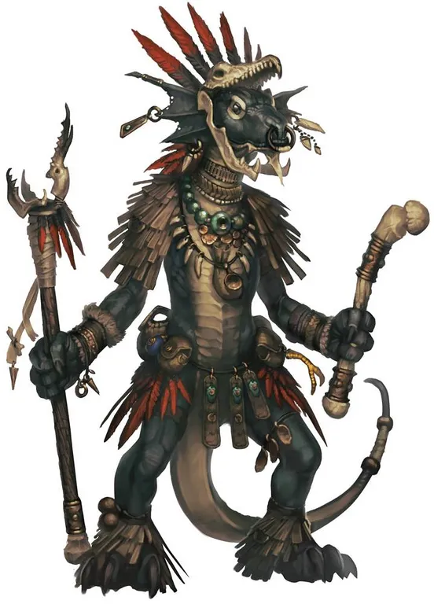

# Sootscale Kobolds

*"DEATH TO [Tartuk](../Campaigns/Kingmaker/NPCs/Tartuk.md)!"*
-The rallying cry of many Sootscale Kobolds.

The Sootscale Kobolds were a clan of Kobolds living in an abandoned tin mine in what would later become Sootscale Hill. Lead by their chieften, Chief Sootscale, the Sootscale Kobolds became involved in a feud with the Mites of Old Sycamore after the manipulation of [Tartuk](../Campaigns/Kingmaker/NPCs/Tartuk.md).

#### Description

Kobolds are small, reptilian humanoids who carry physical similarities to true dragons. They lurk in dark spaces, usually tunnels and mines beneath the earth, in either warrens of their own design or, in the case of the Sootscale Kobolds, complexes discovered and colonized after the original builders have moved on. Though kobolds are far more pragmatic than they are courageous, they use every inch of their cunning to even the playing field between themselves and other, stronger creatures. Kobolds are skilled at working together by necessity, and they often set up ambushes or hit-and-run assaults that allow them to do the most damage possible without being harmed in return. The Sootscale Kobolds followed a system of inherited leadership; the leader of the clan was always named Chief Sootscale, and when a leader died, a new one would be crowned and given the name.

#### History

The Sootscale Kobolds have been active in the [Greenbelt](../Locations/Inner%20Sea%20Region/River%20Kingdoms/Stolen%20Lands/Greenbelt/Greenbelt.md) for quite some time, and for the majority of this time they found themselves an insular and independent community, choosing to keep themselves to themselves rather than pick fights with travelers or monsters. However, this lifestyle was disrupted in 4710 AR by the arrival of an outsider-- the charlatan, [Tartuk](../Campaigns/Kingmaker/NPCs/Tartuk.md).

[Tartuk](../Campaigns/Kingmaker/NPCs/Tartuk.md) was a Kobold who claimed their Religious Idol, Old Sharptooth, was giving him instructions from beyond the beyond. [Tartuk](../Campaigns/Kingmaker/NPCs/Tartuk.md), actually the disguesed gnome [Tartuccio](../Campaigns/Kingmaker/NPCs/Tartuccio.md), intended to destroy the clan from the inside out by sending them to their dooms on the orders of Old Sharptooth. [Tartuk](../Campaigns/Kingmaker/NPCs/Tartuk.md) told Chief Sootscale that only intelligent Kobolds could hear the voice of Sharptooth and, not wanting to look weak in front of his clan, Sootscale pretended he could indeed understand. Slowly [Tartuk](../Campaigns/Kingmaker/NPCs/Tartuk.md) became de-facto leader of the clan. When [Tartuk](../Campaigns/Kingmaker/NPCs/Tartuk.md) had the Sootscales engage in a war with the Mites of Old Sycamore (a fight they could not, in the long run, win), there was an incident whereupon the statuette was stolen by the Mites, and a group of Kobolds were sent to retrieve it. Only one of them (a young scout named Mikimek) returned... and with them, he brought the party. The party, who had befriended Mikimek and defeated the Mites, intervened, and gave Chief Sootscale the push needed to oust [Tartuk](../Campaigns/Kingmaker/NPCs/Tartuk.md) and reclaim his role as leader of the clan.

## General Details

Clan of black-scaled Kobolds from an Abandoned Tin Mine

**Notable Figures**

Mikimek

**Enemies**

Tartuk, Old Sycamore Mites

---

General Details
:   

    Chief Sootscale
