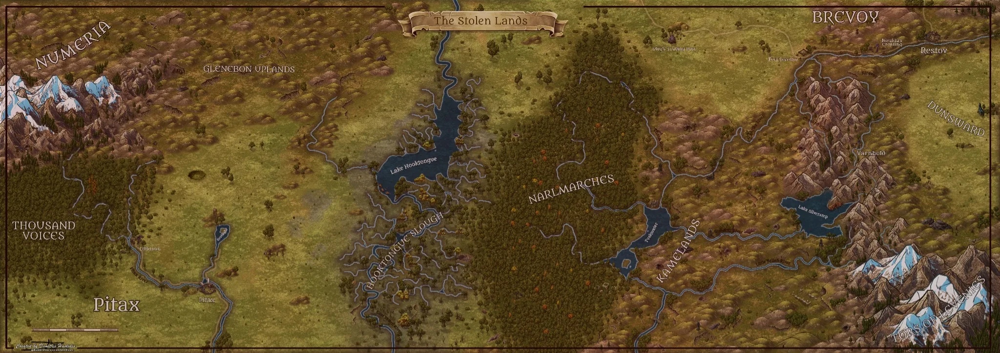

# River Kingdoms

> [!side]
> 
>
> **River Kingdoms**
>
> 

The River Kingdoms of northeastern Avistan have long been a haven for inland pirates, anarchists, exiles, and anyone else who does not fit into the more "civilized" nations. The Kingdoms are by no means a unified nation, but rather a constantly shifting group of small city-states and fiefdoms (never larger than a few thousand souls), each at odds with the others, both to gain more power and prevent their own demise.

### Government

Daggermark, home to the Outlaw Council, is a dangerous place in its own right.
There is no central government in the River Kingdoms, save a loose affiliation of city-states called the Outlaw Council which meets annually in Daggermark. The amount of different kingdoms that form this council is in constant flux as kingdoms are often destroyed, conquered or new kingdoms formed. Beyond the council, each city is ruled by its own smaller council or despot, and the warfare between the nations makes the Outlaw Council often little more than a technicality.

Civil war is another common threat to stable governments here, with assassination and betrayal a simple fact of life in these tumultuous kingdoms. The most vicious of these wars occur when powerful lords, who have been paid vast sums to act as mercenaries in distant wars, return to find their kingdom taken from them. The only thing that ever unites the various River Kingdoms is a serious threat from their neighboring nations. Even then, every single lord vies to be in charge of whatever ramshackle army is assembled to thwart the outsiders. The organization of these rare conglomerate armies are almost as chaotic as the kingdoms themselves with each petty lord trying to outdo his rival with feats of battlefield heroism. Outside of the realm of politics and war, the River Kingdoms are also bound together by the River Freedoms, six tenets they universally hold as close to laws as one will find in the lawless land.

### History

During the Age of Legend, the land encompassing much of the River Kingdoms was a type of hunting reserve for the elves of Kyonin known as Telvurin or the "Shifting Lands". For thousands of years after the elves' exit to Sovyrian just before Earthfall, humans moved in to explore the area, often running afoul of the indigenous lizardfolk, grippli, and fey.

The modern history of the River Kingdoms is almost impossible to keep track of; each year contains enough war, conquest, death, destruction, and betrayal to fill an entire book. With such events occurring so frequently, few bother trying to keep track of the comings and goings of the petty tyrants and their small kingdoms. The only events in the history of the River Kingdoms that have a noticeable effect on the outside world are when one of the kingdoms becomes big and stable enough to be considered a nation in its own right. This is quite a rare occurrence, as most kingdoms fall to infighting and treachery long before they become that powerful. The only two nations that have formed this way are Numeria, which was once considered just another series of squabbling tribes, and Razmiran, which was conquered by the arcane might of the [Razmir](../../../Rules/Deities/Razmir.md), the Living God.

### Geography

Outsea is a small underwater city-state in the central River Kingdoms.
The River Kingdoms are located in the marshy lowlands of the Sellen River basin, where its three branches flow together in their journey south to the Inner Sea. The region borders on Numeria and [Brevoy](../Brevoy/Brevoy.md) in the north, Galt and Kyonin to the south, and Razmiran and Ustalav to the west. There are few roads throughout the land, and the branching web of the Sellen and its tributaries provide the primary means of transportation throughout the region. City-states and fortresses of various sizes and populations are spread across the region, some of which seem to appear overnight, and many that are wiped off the map just as quickly in the constant feuding between settlements.

### Inhabitants

The people of the River Kingdoms are a diverse lot; the only thing most seem to have in common is that they are not the sort of people any "civilised" people would want for neighbours. The River Kingdoms seem to attract a wide range of rogues and outcasts that range from deposed princes to mad sorcerers to religious firebrands. Though the people who inhabit this land come from a huge range of backgrounds, they are all self-reliant and hardy; those who are not do not last long in the River Kingdoms.

Isolated tribes of Ikelek lizardfolk live in the wilder reaches of the River Kingdoms. Normally followers of [Gozreh](../../../Rules/Deities/Gozreh.md) and other nature deities, some of the most remote tribes in the River Kingdoms worship much more sinister entities, such as demons.

#### The River Freedoms

While many outsiders think of the people of the River Kingdoms as dishonorable, backstabbing curs, most have a moral code by which they live. This code, known as the River Freedoms, is a set of moral principles that most natives take very seriously. For instance, one of the codes is that oath breakers must die (usually in a very painful manner). As a result, most people would die before they break their word—and they are also very cautious about giving their word in the first place. The River Freedoms are highly respected throughout the various realms of the River Kingdoms, and breaking one is a serious offense, even for those who claim to only have misinterpreted one of them.

The River Freedoms are:

- Say What you Will, I Live Free
- Oathbreakers Die
- Walk Any Road, Float Any River
- Courts Are for Kings
- Slavery Is an Abomination
- You Have What You Hold

### Religion

Due to the freedom-loving and cynical nature of most inhabitants of the River Kingdoms, religion is often given short shrift. Those who do practice a religion pray to deities of thievery, war, and freedom. The churches of [Cayden Cailean](../../../Rules/Deities/Cayden%20Cailean.md), [Desna](../../../Rules/Deities/Desna.md), Calistria, and [Gorum](../../../Rules/Deities/Gorum.md) are the most common, although Norgorber, the god of murder, thievery, and secrets is also popular. Additionally, cults of two gods forbidden throughout Avistan and Garund have found the region to be a safe haven: Hanspur and Gyronna. The region also attracts strange cults in the same way they attract strange people, and small religions ranging from the unorthodox to the downright bizarre make their home here.

