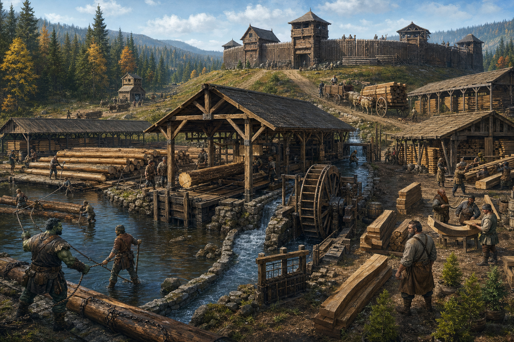

# Fort Serenko Lumberworks

*Compiled by Anika Sorn, Lecturer in Forestry and Material Supply, College of Roads and Rivers, Free University of Thumping Waters, from the work ledgers of Serenko Lumberworks, surveys of the millrace, and interviews with Harl Edvane and the crews of Fort Serenko; with travel recollections supplied by Velka of the Sootscale*

> A straight board begins in a crooked forest. Respect both facts.
>
> — Harl Edvane

Serenko Lumberworks is a sawmill, timber yard, and forestry concern adjoining the restored walls of Fort Serenko in the Rostland Hinterlands. Powered by a controlled millrace, it supplies structural timbers, planks, shingles, bridge members, wagon stock, palisade logs, and seasoned joinery wood to the fort and settlements throughout the northern Republic of Thumping Waters.

The lumberworks grew from the practical requirements of resettling an abandoned wooden fort. Its first crews cut replacement stakes and roof beams for the old defenses. Within a few years, the same mill had become one of the Republic's principal northern sources of finished timber. The enterprise remains closely tied to the fort: its fire watch uses the ramparts, its workers drill with the garrison during emergencies, and its yards occupy ground once cleared to deny attackers cover.

The works are directed by Harl Edvane, a grizzled foreman whose suspicion of wasted timber is surpassed only by his suspicion of unnecessary conversation. Harl's friendship with Velka of the Sootscale has made the lumberworks a regular source of river-worn wood for her talismans and a frequently cited example of faith entering an institution through the side gate while everyone insists it is merely good water management.

  

### At a Glance

**Type:** Sawmill, timber yard, and forestry concern

**Location:** Fort Serenko, Rostland Hinterlands

**Master of the Works:** Harl Edvane

**Power:** River-fed millrace and auxiliary treadle machinery

**Principal Products:** Structural timber, planks, shingles, palisade logs, bridge members, wagon stock, and joinery wood

**Primary Transport:** Local log drives and overland freight

**Academic Partner:** College of Roads and Rivers, Free University of Thumping Waters

**Yard Rule:** *Count the tree twice: once before cutting and once after planting*

  

### From Barracks Timber to Public Works

Fort Serenko stood for years upon Brevoy's southern border before worsening tensions between Rostland and Issia recalled its soldiers and scouts to Restov. The garrison departed quickly but in good order, leaving a small wooden fortification rather than a ruin produced by siege or fire. When the Tubthumpers reached it on 18 Sarenith 4710 AR, they found an empty defensive site capable of becoming a barracks if incorporated into a new settlement.

Occupation required repair before ceremony. Palisade stakes had softened at ground level, several roofs admitted rain, gate timbers had warped, and neglected drainage threatened foundations that no enemy had managed to breach. The first woods crews established sawpits within the cleared ground outside the walls and cut only what the restoration required.

A narrow stream near the fort offered sufficient fall for a millrace. Settlers widened and lined an existing drainage channel, built a headgate, and installed a modest waterwheel driving a reciprocating saw. The first mill shed was erected largely from its own early output. Its boards repaired the barracks, watch platforms, storehouses, stables, and neighboring homes.

Demand continued after the fort was secure. Northern farms required barns, fences, carts, tool handles, and mills. Roads and bridges consumed heavy timbers. Thumpington's growth drew seasoned boards from every reliable supplier, while new settlements needed material faster than local sawpits could prepare it. Fort Serenko expanded its mill without surrendering the defensible clear ground upon which the fort depended.

The resulting enterprise took the fort's name rather than Harl's. He explains that Fort Serenko already appears on maps, while *Edvane's Excellent Boards* sounds like a promise made by someone planning to leave before winter reveals the truth.

  

### The Lumberworks

  

#### The Millrace

The millrace diverts part of the local stream through a stone-lined channel above the works. Adjustable wooden gates control the flow to the wheel and allow the channel to be drained for cleaning or repair. A spillway returns excess water before it can undermine the yard. Screens intercept branches, stones, ice, and loose equipment whose owners have failed to store it responsibly.

The wheel powers the main frame saw and, through separate belts and shafts, several smaller devices used for boring, planing, and lifting. The machinery is intentionally simple enough to disconnect by hand. When water is low, treadles and animal power keep essential work moving at reduced speed. When water is high, no production target overrides an order to close the headgate.

The stream is not a dependable highway to the southern Republic. Cascades and broken watercourses make long-distance commercial navigation impractical. Logs travel only short, managed stretches to the mill's holding boom. Finished timber leaves Fort Serenko principally by wagon, with specially shaped bridge and mill components packed to avoid damage upon rough roads.

  

#### The Log Boom and Pond

Upstream crews guide marked logs into a holding pond formed beside the millrace intake. Chained booms divide timber by cutting tract, species, and intended use. River crews wearing cork-lined belts and carrying hooked poles release only the number of logs the sorting channel can safely receive.

Logjams are the works' most public hazard. A jam can halt the wheel, damage the headgate, flood the lower yard, or release timber downstream with lethal force. A brass bell beside the pond signals changes in water level and orders every worker clear before a jam is broken. No one is permitted to stand upon a loaded boom merely because doing so would produce a better view.

  

#### The Saw Hall

The saw hall is a long, open-sided structure roofed against rain and sparks from the adjacent smithy. The principal frame saw converts heavy logs into beams and boards. Smaller benches handle edging, trimming, boring, and the preparation of standardized construction pieces.

Noise governs the hall's customs. Orders are given with agreed hand signals, and visitors receive brightly dyed shoulder cords identifying them as people unlikely to understand those signals. Workers do not step across a moving belt, reach beneath a suspended log, or attempt to retrieve a dropped object until the machinery has stopped and the wheel brake is set.

Every finished piece receives a chalk mark recording species, grade, dimensions, and drying destination. Timber intended for bridges, gates, hoists, or other safety-critical uses is inspected by someone other than the sawyer who cut it.

  

#### The Seasoning Yards

Fresh boards are stacked beneath long ventilated sheds with narrow spacers between each course. Roofs protect the timber from direct rain while open walls permit the persistent northern wind to move through it. Each stack bears a date, cutting tract, species mark, and intended grade.

Two low drying houses accelerate the preparation of ordinary construction lumber during urgent projects. Harl does not permit kiln-dried speed to be mistaken for universal quality. Thick beams, wheel stock, fine joinery wood, and pieces expected to survive repeated wetting receive slower treatment appropriate to their use.

The yard also maintains separate racks for curved limbs, forked braces, root crooks, and other naturally shaped pieces. These are valuable for boats, roof frames, wheels, and machinery precisely because the tree has already placed strength along the required curve.

  

#### The Joinery and Pattern Shed

The pattern shed produces components that would be expensive to shape after transport: bridge braces, mill teeth, wheel rims, gate pivots, wagon parts, roof trusses, and replacement pieces copied from damaged originals. Full-sized patterns hang from rafters beside notes identifying the project for which each was made.

Patterns commissioned with public money remain available for later civic repairs. Private designs may be restricted by contract, although Harl refuses agreements claiming ownership over ordinary wedges, pegs, rectangular doors, or other discoveries already made by carpenters several thousand years ago.

  

#### The Scrap House

Offcuts are sorted rather than heaped indiscriminately. Sound pieces become pegs, shingles, handles, toys, crates, kindling, carving blanks, or material for apprentices. Bark and clean sawdust supply tanneries, smokehouses, animal bedding, compost, and fuel mixtures. Diseased wood and contaminated waste are burned under supervision or buried where they cannot spread pests.

River-worn fragments, unusually figured scraps, and pieces too small for structural work are kept in an open bin beside Harl's office. Velka selects materials for devotional charms there. Other visitors may take modest quantities with permission, provided they do not describe the free scrap as worthless while standing within Harl's hearing.

  

### The Working Forest

Serenko Lumberworks does not own every tree surrounding the fort. Cutting rights are granted by the Republic and administered with Fort Serenko's settlement authorities and the Ministry of the Interior. Surveyors mark harvest areas, protected watercourses, seed trees, unstable slopes, roads, and stands reserved for future needs.

Crews practice selective cutting where terrain and species allow it. Clear cutting is confined to defensive clearances, roads, building sites, diseased stands, and tracts whose regeneration plan requires open light. Young trees are protected from wagon damage, and streamside roots are left intact to reduce erosion into the millrace and downstream waters.

The yard rule—*Count the tree twice: once before cutting and once after planting*—requires each cutting ledger to record both removed timber and regeneration work. Planting alone does not satisfy the rule. Crews also record surviving seedlings, natural regrowth, fire damage, browsing, disease, and whether a tract can support another harvest without becoming a field of optimistic sticks.

Hunters, herbalists, trappers, and nearby households may petition against cutting that threatens game trails, medicinal plants, springs, sacred places, or customary gathering grounds. Not every petition prevents a harvest, but each must enter the tract record before axes are issued.

  

### People of Serenko Lumberworks

  

#### Harl Edvane, Master of the Works

Harl Edvane is built like a log and nearly as willing to move. His beard is streaked with gray and sawdust, his voice carries easily over machinery, and his approval most often takes the form of assigning someone work that matters.

Harl began as a carpenter and military sawyer during Fort Serenko's restoration. He understands the works as infrastructure rather than merely a profitable yard. A late timber shipment can delay a bridge, expose a roof, or leave a settlement without repairs before winter. He therefore values accurate promises above ambitious ones.

He claims no interest in religion. A driftwood charm made by Velka nevertheless hangs above his office door. Harl says it improves the balance of the frame, though it has remained in place through two replacements of the frame itself.

  

#### Mira Volen, Clerk of Marks

Mira Volen keeps the cutting ledgers, timber grades, transport schedules, payroll, public contracts, and records of regeneration. The daughter of a Rostlander charcoal burner, she can identify most local woods by smell and several unreliable contractors by the sound of their explanations.

Mira developed the current system of colored end marks after two bridge beams spent a month traveling toward different bridges. Her office maintains maps showing every active tract and stack. During fires or storms, those maps become emergency records of roads, water sources, crews, animals, and equipment in the forest.

  

#### Daska Broadbough, River Boss

Daska Broadbough is a half-orc river worker responsible for the holding pond, booms, headgate crews, and short log drives. She is an exceptional swimmer who treats that ability as a final precaution rather than permission to take foolish risks.

Daska introduced the jam bell, mandatory rope teams, and the rule requiring a second observer before anyone works near a loaded boom. Workers who call these measures excessive are invited to explain their preferred procedure while standing safely upon dry ground.

  

#### Perren Bale, Yardwright

Perren Bale is a halfling carpenter who directs the pattern shed and apprenticeship benches. He specializes in reducing large engineering drawings into pieces that can be cut, marked, transported, and assembled by crews who may never meet the original designer.

Perren's teaching begins with crates, wedges, spacers, and handles before advancing to bridge members or mill machinery. He tells apprentices that grand structures fail at small connections and that anyone too important to shape a peg is too important to be trusted with a roof.

  

### Velka and the High Water

Velka of the Sootscale first came to Serenko Lumberworks seeking driftwood for her talismans. Harl mistook her for a scavenger and nearly ordered her from the yard. She responded by asking permission, helping clear a blocked trough, and blessing the water without interrupting anyone's work. Harl later placed several pieces of river-worn wood aside for her and has continued doing so with increasing regularity and decreasing acknowledgment.

During high water, logs sometimes bind against the outer boom in a tightening mass. Velka walks the bank with Daska's crews, watching the current and identifying where pressure is accumulating. Her prayers to Hanspur accompany practical work with ropes, poles, wedges, and opened spill gates. More than one dangerous jam has loosened while she murmured from the shallows.

Harl calls this luck informed by competent observation. Velka calls it listening. Their disagreement has survived long enough to become a friendship. She brings him Lanternlight Gin from Embeth Hall; he saves her wood shaped by current rather than saw. They commonly share the bottle beside the sawpits without discovering any urgent need to speak.

  

### Fire, Flood, and Defense

A lumberworks beneath wooden fortifications cannot treat fire as an abstract possibility. Smoking is prohibited within the yards. Spark-producing work remains confined to cleared stone surfaces. Cisterns, sand bins, hooks, axes, wet blankets, and hand pumps stand at marked stations throughout the works. Sawdust is removed daily from machinery and never permitted to accumulate beneath bearings.

The fort's watch includes the seasoning yards in its regular circuit. A dedicated fire bell can be heard from the barracks, while the higher ramparts provide a view of smoke rising from distant cutting tracts. During dry weather, water wagons remain loaded and forest crews carry tools for containing a new fire before wind carries it into mature timber.

Flood plans reverse the usual priority of production. Crews secure loose stock, open spillways, clear the lower yard, shut down the wheel, and move animals and records uphill. Only after people are accounted for do they attempt to preserve timber. Harl notes that boards may be cut again, while trained sawyers have proven inconvenient to manufacture.

Workers also drill with Fort Serenko's garrison. In an attack, the yard can supply barricades, stakes, repair timber, ladders, carts, and trained teams capable of reinforcing damaged structures. The lumberworks does not maintain a separate militia, but nearly every crew understands the fort's alarms and evacuation routes.

  

### Trade and Public Works

Serenko timber travels north toward Rostland and south or west through the Republic by wagon. The yard maintains standard dimensions for common beams and boards, allowing settlements to order material without sending a carpenter to inspect every piece. Unusual work is cut to pattern and marked for assembly.

Fort repairs receive first consideration when structural safety is at issue, followed by emergency public works and contracts already promised for seasonal deadlines. The lumberworks has supplied bridges, mills, palisades, barracks, warehouses, roofs, wagons, and rebuilding efforts across the northern territories.

The works exchange patterns and failure reports with the Joined Hands in Tatzlford. Lissa Tarmel has inspected Serenko bridge stock, while Perren Bale has sent the guild full-sized patterns for replacement mill parts. Neither institution regards a cracked beam as confidential merely because admitting the failure may embarrass its maker.

  

### The College of Roads and Rivers

The College of Roads and Rivers uses Serenko Lumberworks as a seasonal field station for forestry, material grading, hydraulic power, transport planning, and the maintenance of public structures. Students measure stream flow, inspect drying stacks, compare growth rings with tract records, and discover that a correct calculation does not move a wet log unless someone also brings a hook.

University studies helped refine the spillway, timber-mark system, and regeneration surveys. The lumberworks has in turn corrected academic proposals whose authors underestimated mud, ice, labor, frightened oxen, or the tendency of water to disregard a diagram.

The best-known joint paper, *Short Drives, Broken Water: Timber Movement above the Northern Cascades*, explains why Fort Serenko's local water power does not make the Shrike a reliable commercial route to the south. Copies circulate among surveyors, millers, settlement planners, and officials periodically tempted to solve every transport problem by drawing a straight blue line across a map.

  

### Customs of the Works

  

#### The First Board

The first sound board cut from a newly opened tract is not sold. Workers mark it with the tract, date, crew, and principal species, then store it in the pattern shed. When the same tract is judged ready for another harvest, the old board is brought back to compare the promise entered in the ledger with the forest that actually grew.

  

#### The Ring Count

Apprentices completing their first season select a discarded cross-section and count its growth rings before the yard meal. The exercise is less an examination than an introduction to humility. Most discover they are younger than the material they have spent the season treating as inventory.

  

#### The Logjam Bell

The brass bell beside the holding pond is sounded once for a halted intake, twice for a dangerous jam, and continuously for an uncontrolled release or flood. On the anniversary of the worst jam broken without loss of life, Daska rings it twice after the wheel stops for the evening. Workers then drink to everyone who obeyed the order to step back.

  

#### The Useful Scrap

At midwinter, the scrap house opens its sound offcuts to households, schools, shrines, and apprentices. Toys, handles, stools, pegs, boxes, carvings, and kindling leave the yard in sledges and handcarts. The custom reflects Harl's belief that a piece too small for the contract may still be exactly large enough for the need.

  

### Place in Fort Serenko

Serenko Lumberworks is often described as Fort Serenko's principal industry, but the relationship runs in both directions. The fort protects the mill, road, workers, and timber reserves. The lumberworks preserves the fort's walls, roofs, gates, platforms, and ability to respond quickly when something breaks.

Together they embody the settlement's transformation from abandoned border post into a working northern community. The old fort was left standing because its soldiers were needed elsewhere. Its restoration did not erase that history. It gave the empty defenses a population, an economy, and a reason to endure beyond the next military alarm.

Visitors usually remember the scent first: pine, wet bark, resin, smoke, and fresh-cut wood carried across the palisade. Residents remember the rhythm—the steady saw, the headgate bell, the wagon wheels, and the hammering of boards intended for some structure whose builders may never know the forest from which they came.

> The fort keeps enemies out. The yard gives people a reason to stay inside.
>
> — Mira Volen
