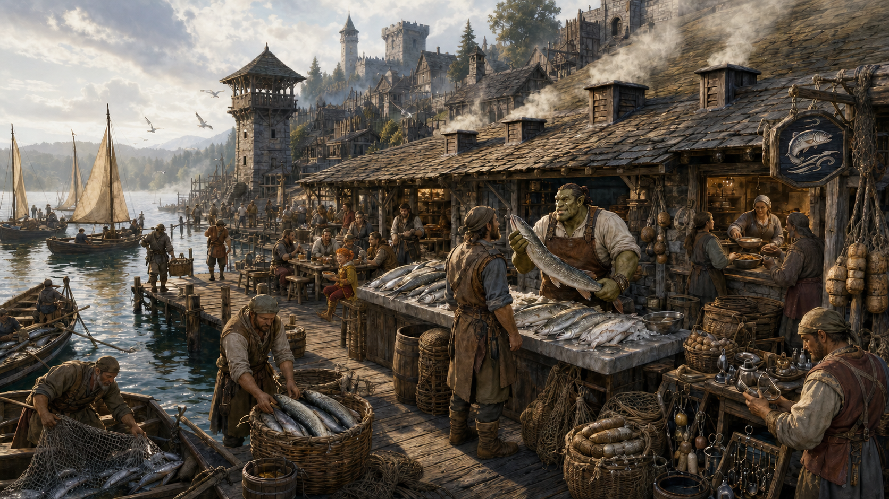

# Briny Wake

*A Lantern and Ledger guide to Fort Tuskwater's working waterfront, compiled from the settlement gazetteer, harbor records, and the travel recollections of Velka of the Sootscale*

> A clean smoke, a sharp knife, and a lake that still frightens you a little. That's how you keep fish worth eating.
>
> — Marrek Holt

The Briny Wake is a waterfront fishmonger, smokehouse, and dockside kitchen on the northern shore of Lake Tuskwater. Its broad-shouldered proprietor, Marrek Holt, buys directly from the fort's fishing crews, cleans and preserves their catch, and serves food to the workers who keep the republic's southern trade hub moving.

The building is neither an inn nor a fashionable tavern. Travelers seeking beds, roaring hearths, and Fortfire ale are directed uphill to the Stag's Respite. Those seeking smoked trout, hot fish stew, trustworthy news from the lake, or someone who knows which crew will carry a parcel south are told to follow the gulls and the smell of alder smoke.

  

### At a Glance

**Type:** Fishmonger, smokehouse, dockside kitchen, and chandlery counter

**Location:** Waterfront of Fort Tuskwater

**Proprietor:** Marrek Holt

**Primary Trade:** Fresh, smoked, salted, and preserved fish

**Known For:** Silver pike, lake trout, smoked eel, fish stew, and reliable lake reports

**Clientele:** Fishing crews, dockworkers, merchants, watch patrols, and travelers

**Associated Person:** Velka of the Sootscale

**House Rule:** *If it smells wrong, it is wrong*

  

### On the Fort Tuskwater Waterfront

Fort Tuskwater stands where the ruins of the Stag Lord's fortress once overlooked the lake. Its walls still bear old scars, but its piers now carry fishing boats rather than bandit patrols. The Briny Wake occupies a long, low building near the busiest stretch of waterfront, between the landing used by the fishing fleets and the marketplace where their catch enters the wider economy of Thumping Waters.

The harbor bell begins the working day before sunrise. By its first toll, the Wake's cutting tables are scrubbed, smoking fires are lit, water barrels are checked, and chalkboards list the crews expected to return. At sunset the waterfront becomes louder: boats crowd the piers, traders bargain over silver pike and lake trout, gulls offer unsolicited opinions, and Marrek decides what must be sold fresh, smoked immediately, salted, cooked, or rejected.

The shop participates in the town's practical division of labor. The Stag's Respite houses travelers and serves as the fort's principal inn. The marketplace handles broad retail trade. The Briny Wake specializes in the narrow interval between a living lake and a meal that will remain safe after a journey by road or boat.

  

### History

Fort Tuskwater was founded on 24 Gozren 4712 AR after builders, masons, and fisherfolk reclaimed the Stag Lord's ruined stronghold. Its harbor was dredged, new palisades raised, and the former bandit fort gradually remade into a lakeside settlement. As its fleets expanded, preserving the daily catch became as important as catching it.

Marrek Holt began with a covered cleaning bench, two smoking cabinets, and an agreement to buy whatever local crews could not sell before nightfall. The arrangement reduced waste and gave fishermen a dependable buyer during unusually large catches. Marrek added a public counter, cooking hearth, net-repair corner, and larger smoke rooms as the fort grew into the republic's southern trade hub.

The name *Briny Wake* began as a fisherman's joke. Lake Tuskwater is not a sea, but its crews speak of brine, storms, shoals, and wakes with the gravity of sailors anywhere. The word *wake* also suits a settlement built behind the passing violence of the Stag Lord. Marrek does not explain which meaning he prefers.

  

### The Building

  

#### The Fish Counter

A broad street-facing counter displays the day's fresh catch on slanted stone beds cooled with lake water and ice when available. Chalk marks identify the species, boat, landing time, and price. Fish too damaged for the fresh counter may still enter the stew pot or smokehouse, but only after inspection and at a clearly different price.

Marrek considers the name of the catching boat part of the product. A crew that mishandles fish, disguises an old catch, or works suspect water cannot disappear behind the Wake's reputation. Conversely, crews known for clean decks and quick landings command better terms.

  

#### The Cutting Floor

The central workroom contains stone-topped tables, hanging scales, knives, gutting troughs, barrels for clean water, and lidded containers for waste. Floor channels drain toward settling traps rather than directly into the street. Solid remains are rendered, composted where safe, or removed beyond the waterfront under local sanitation rules.

Fort Tuskwater's sewer system is a matter of local pride, but Marrek refuses to treat it as permission to pour grease, blood, salt, and spoiled flesh into the drains. The harbor and the fishery are the same resource viewed from different sides of the counter.

  

#### The Smoke Rooms

Separate smoke rooms allow Marrek to manage cool smoking for longer preservation and hotter smoking for fish intended to be eaten promptly. Alder is the usual fuel, supplemented by carefully selected fruitwood when merchants can supply it. Resinous timber is forbidden regardless of how little it costs.

Each rack is tagged with species, preparation, fire, and starting time. Apprentices learn to read color and texture but are not permitted to replace written records with confidence. Marrek says confidence has ruined more food than rain.

  

#### The Dockside Kitchen

The kitchen serves workers who cannot wait for the evening stew festival or climb to the Stag's Respite between shifts. Its usual fare includes smoked-trout cakes, fried pike, eel skewers, dark bread, pickled roots, and a thick fish stew that changes with the catch. Lake wine and ordinary ale are available, but the Wake does not attempt to compete with a proper tavern.

The communal tables overlook the piers. Their patrons exchange weather, net, cargo, and monster reports with the frankness of people who may depend upon one another before the next meal. Scholars studying Lake Tuskwater's unusual ecology also frequent the room, though Marrek charges extra when their specimens escape.

  

#### The Chandlery Corner

A small side counter sells hooks, line, cork floats, needles, lamp wicks, salt, simple knives, and lengths of scrap rope. It also accepts repair work on nets and baskets. Behind it stands a weathered crate marked *Velka's Bits*, filled with driftwood, shells, worn cord, odd stones, and small pieces of metal set aside for Velka's talismans.

  

### Marrek Holt

Marrek Holt is a broad-shouldered half-orc with deep laugh lines, a powerful working voice, and an ability to identify several fishing crews by the sound of their arguments. He is generous with food, cautious with credit, and unwilling to flatter either suppliers or customers about the condition of a fish.

He serves informally as a bridge between crews, merchants, and the harbormaster's council. Although he holds no permanent council seat, guild representatives seek his figures when discussing catch limits, dock repairs, sanitation, or emergency provisions. Marrek knows how much fish entered his shop, where it was caught, what condition it arrived in, and whether buyers complained afterward.

His humor should not be mistaken for carelessness. He has closed the Wake voluntarily during doubtful catches and has destroyed stock that could probably have been sold before anyone noticed. Fort Tuskwater lives by the lake; Marrek believes that means the town cannot afford to lie about what the lake provides.

  

### The Season of Sick Fish

The friendship between Marrek and Velka began during a season when several catches arrived pale, soft, and visibly unwell. Rumor blamed everything from poor bait to submerged ruins, southern-water monsters, sabotage, and the remembered curse of the old fortress. Marrek stopped selling the affected fish and reported the problem to the harbormaster's council despite the immediate loss to his business.

Velka walked the shallows at dawn, examined the water and fish, spoke with crews about their routes, and performed rites of renewal to Hanspur. By evening, boats working cleaner water returned with healthy catches. Whether her prayers cleansed the lake, led the crews away from a temporary pocket of corruption, or simply caused frightened people to observe the water more carefully remains disputed.

The response that followed is less disputed. The council marked the suspect fishing ground, the Wake recorded where every questionable catch had been taken, and local crews adopted clearer reporting rules for sick fish, strange water, and unusual shadows. Marrek credits Velka with saving both lives and the fishery's reputation. Velka says the lake warned them and they finally listened.

  

### Velka at the Wake

Velka is a familiar sight at the Briny Wake, her scales wet with spray as she blesses nets, helps clean the day's catch, and exchanges jokes with dockhands. She refers to fish that enter a net without needless suffering as having *swum willing*, a phrase that has become local shorthand for a clean and fortunate catch.

Marrek calls her *Captain Mudfoot*. She objects every time with declining credibility. In return, she blesses his smoke rooms, reorganizes the contents of Velka's Bits, and leaves driftwood charms where he will pretend not to notice them.

On calm nights, Marrek and Velka share bread and lake wine on the dock after the final cleaning. Their friendship gives the Wake a modest religious role without making it a formal shrine. Fishers of many faiths ask Velka for blessings, but no one is required to pray before selling a catch or receiving a meal.

  

### Customs and Practices

  

#### The First Fish

The first sound fish purchased each morning is marked in the ledger but not placed on the sales counter. It is cooked for the work crew and anyone who arrived too early to afford breakfast. Marrek says people judge fish more honestly after eating some.

  

#### Clean-Net Chalk

Boats that report illness, tainted water, or contaminated equipment receive a white chalk mark while their catch and gear are examined. The mark is not a punishment and cannot be used to deny a crew ordinary harbor services. Concealing a concern to avoid inspection is treated far more seriously than raising a false alarm.

  

#### The Returning Lanterns

At twilight, the Wake places small lamps along its dock rail as the fleets return. The practice mirrors the hundred lanterns reflected across Lake Tuskwater each evening and helps crews judge the landing in mist. A lamp remains unlit for every boat known to be overdue.

  

#### Wake Stew

During the marketplace's weekly fish-and-fiddle celebrations, the Wake prepares a communal kettle from safe trimmings and donated catch. The first bowls go to crews repairing boats, members of the watch, and families of fishers currently upon the southern waters. Musicians are paid in coin unless they explicitly request stew.

  

### Harbor and Civic Role

The Briny Wake contributes to Fort Tuskwater's harbormaster-led economy through catch records, preservation capacity, sanitation, and informal intelligence. Its staff often hear the first reports of damaged piers, missing boats, unusual currents, sick fish, or shapes moving beneath the deep southern waters.

During emergencies, its smoking rooms preserve food for the militia and population, while its kitchen can feed watch patrols and lake crews working extended shifts. The building keeps coils of rescue rope and flotation barrels near the dock. Like most citizens of the fort, its workers are expected to know how to throw a rope and hold a spear.

The Wake also represents the fort's larger transformation. The Stag Lord's fortress extracted wealth through fear. Marrek's business depends upon rules, mutual trust, honest weights, clean water, and boats returning safely to harbor. Both occupied the same shore. Only one leaves enough behind for tomorrow.

  
> The lake remembers, they say. Good. So do our ledgers. If something was wrong with yesterday's catch, I want both of them telling us before breakfast.
>
> — Marrek Holt
