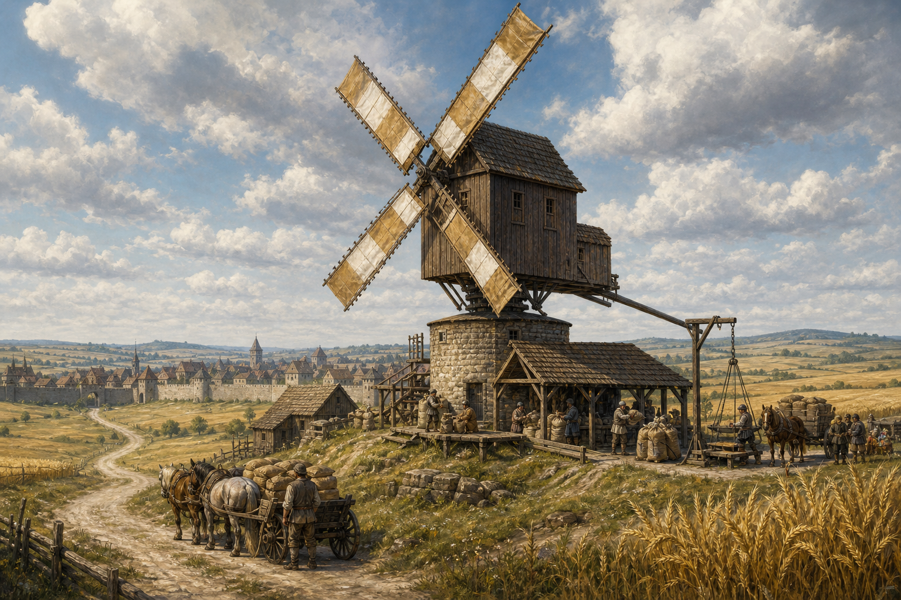

# Levet's Mill

*Compiled by Tomas Vey, Lecturer in Agricultural Works, College of Roads and Rivers, Free University of Thumping Waters, from Olegton's construction records, mill ledgers, and interviews with Tavena Levet, local farmers, bakers, and teamsters*

> Grain keeps no promises until it becomes flour.
>
> — Tavena Levet

Levet's Mill is a wind-powered gristmill and grain exchange standing upon the open northern edge of Olegton. Its four broad sails rise above the town's stone wall and can be seen from the South Rostland Road long before a traveler reaches the old palisade of Oleg's Trading Post.

The mill processes wheat, rye, barley, oats, buckwheat, and other local grain into flour, meal, brewing stock, and animal feed. It also weighs deliveries, grades grain, coordinates storage with Olegton's granary, and maintains emergency milling capacity for the northern settlements of the Republic of Thumping Waters.

Tavena Levet owns and operates the mill. She is loud, practical, stubborn, and capable of identifying a damaged bearing by sound while continuing an unrelated argument at full volume. Her friendship with Velka of the Sootscale is marked by a small bowl of water placed beside the entrance each morning. Tavena calls it dust control. Everyone who has heard her ask Velka for a blessing understands that the explanation is incomplete.

  

### At a Glance

**Type:** Wind-powered gristmill and grain exchange

**Location:** Northern edge of Olegton

**Proprietor and Master Miller:** Tavena Levet

**Principal Power:** Four-sail post mill

**Backup Power:** Horse gin within the stone roundhouse

**Principal Products:** Flour, meal, brewing grain, bran, and animal feed

**Academic Partner:** College of Roads and Rivers, Free University of Thumping Waters

**Visible Landmark:** White-and-ochre sails above Olegton's northern wall

  

### Where the Grasslands Meet the Greenbelt

Olegton stands upon the northern edge of the Republic where the settled Greenbelt opens toward Rostland's grasslands. It is a town of roads, fields, wagons, walls, and markets rather than docks. Grain arrives from surrounding farms in carts and pack trains, while finished flour travels south toward Thumpington or west and east along the Republic's expanding road network.

The same open country that exposes Olegton to northern weather provides the mill's power. Wind rolls across the grasslands with few obstacles before reaching the low rise beyond the town wall. Builders placed Levet's Mill there deliberately, outside the crowded center but close enough to the granary, marketplace, brewery, and old trading post for carts to reach it without crossing residential streets.

The sails have become an unofficial signal to travelers. A turning mill means the road remains open, the town is occupied, and ordinary work continues. Furled sails may mean calm weather, maintenance, dangerous wind, or a shortage of grain. Sails stopped at an agreed diagonal warn the watch that the mill requires assistance.

  

### Founding

Olegton began with Oleg and Svetlana Leveton's trading post, a palisaded refuge where trappers, merchants, settlers, and the Tubthumpers found their first dependable northern foothold. As cottages, workshops, fields, a marketplace, and a brewery grew around the old post, grain became one of the town's most important goods.

Early households ground meal by hand or carried grain north into Rostland. Larger harvests made both arrangements impractical. Transporting unground grain consumed wagon space, delayed bakers and brewers, and left the settlement dependent upon mills beyond the Republic's control.

Olegton authorized construction of a local mill during its first sustained period of civic growth. Tavena Levet, already experienced with millstones, grain buying, and wagon teams, argued against waiting for a water site that did not exist. The grasslands supplied wind in abundance. The town supplied timber, stone, iron fittings, labor, and citizens prepared to discover how many people were required to raise a mill body onto a central post.

The first season produced coarse but dependable meal. Subsequent improvements added a second pair of stones, better sail controls, dust chutes, a stone roundhouse, testing rooms, wagon scales, and the horse-powered backup. The mill's expansion followed Olegton's own transformation from trading post into walled agricultural town.

  

### The Mill

  

#### The Post Mill

The working millhouse is a heavy timber structure balanced upon a central oak post and surrounding trestle. Unlike a fixed tower mill, the entire upper building can turn. A long tailpole, winding chain, and ground capstan allow the crew to rotate the millhouse until its sails face the wind.

The mechanism rests above a low circular roundhouse of local stone. The roundhouse protects the trestle, provides secure storage, and keeps wagon traffic away from the turning mill body. The timber above is tarred and painted against weather, with white trim and ochre panels visible from the road.

Repairs are dated rather than hidden. Close inspection reveals replacement braces, iron straps, new shingles, and several different generations of sail cloth. Tavena says a mill without visible repairs either has not worked or has employed a dishonest painter.

  

#### The Sails

Four wooden sail frames carry removable lengths of tightly woven cloth. The crew spreads or reefs the cloth according to the strength of the wind. More cloth produces greater power in light air; less cloth protects the machinery when gusts become dangerous.

The sails are painted in alternating white and ochre sections. The colors make their movement visible against both cloud and blue sky, helping workers judge speed from the ground. Ropes, pegs, and braces are inspected before every working period. No one climbs a sail until the brake is set, the stones are disengaged, and a second worker holds the control key.

Strong wind is not automatically useful wind. Sudden gusts can overheat bearings, crack gears, overspeed the stones, or turn a loose sail into an object with strong opinions about architecture. Tavena shuts the mill before conditions become dangerous, regardless of how urgently a customer explains that the grain is needed.

  

#### The Windshaft and Gears

The windshaft carries power from the sails through a large brake wheel and wooden gears into the millhouse. Replaceable hardwood teeth are set individually into the larger wheels. A damaged tooth can therefore be changed without rebuilding the entire gear.

Separate controls engage either pair of millstones. The mill may grind fine flour with one set while preparing coarse meal or feed with the other. Belts and small shafts power grain lifts, sifters, and cleaning screens when sufficient wind remains after the stones receive their share.

The machinery is loud enough to make ordinary conversation difficult. Workers use hand signals and touch agreed points upon the timber frame to feel changes in vibration. Apprentices learn that the mill speaks constantly; the challenge is noticing when it has begun to say something new.

  

#### The Grinding Floor

Grain descends from bins through adjustable hoppers into the center of paired millstones. The upper runner stone turns while the lower bedstone remains fixed. Grooves cut into their faces shear the grain and move the resulting flour outward toward collection chutes.

The distance between stones is adjusted for the grain and intended product. Stones set too close scorch flour and shed grit. Stones set too far apart waste time and produce an uneven grind. Tavena examines color, smell, warmth, and texture throughout a run rather than trusting the setting that worked yesterday.

Grinding stations stand upon raised platforms isolated from much of the mill's vibration. Guards cover exposed gears, collection sacks are tied before filling, and wooden scrapers keep hands away from moving parts. Visitors remain behind a marked rail unless accompanied by a miller.

  

#### The Sifting Room

Ground flour passes through cloth and wire screens separating fine flour, ordinary meal, bran, and material requiring another pass through the stones. The room is kept dry, ventilated, and free of open flame. Workers wear simple cloth masks during dusty work and change them regularly.

Fine white flour commands the highest price in some markets, but Levet's Mill does not treat it as the only respectable product. Darker flour and whole meal retain different qualities and store differently. Bran feeds animals, enriches bread, and supplies several local brewers and cooks whose opinions about texture are stronger than their interest in fashion.

  

#### The Stone Roundhouse

The circular stone level beneath the post mill contains the trestle, tool rooms, spare gear teeth, repair timber, ropes, sail cloth, scales, and the mill's horse-powered backup. Thick walls protect the main post from weather and reduce the spread of fire from nearby yards.

The horse gin turns a vertical shaft through a slow walking circuit. It cannot match a strong wind and is expensive in fodder and labor, but it can operate one pair of stones during calm weather or mechanical work upon the sails. Tavena uses it for urgent community needs rather than ordinary production.

Children are not permitted within the horse circuit while it is engaged. The rule exists despite several children explaining that they are quick, the horse likes them, and nothing went wrong the previous time they entered without permission.

  

#### The Grain Exchange

A long, lower building beside the mill contains the receiving floor, wagon scales, clerk's desk, testing bench, and covered loading bays. Farmers may sell grain directly, pay for milling, exchange a portion of grain for finished flour, or store approved deliveries in Olegton's granary under separate agreement.

Every load is sampled from several sacks. Mill workers check moisture, insects, mold, stones, weed seed, mixed grain, and evidence that excellent grain has been placed over inferior material for the benefit of the inspector. Weights are recorded in front of the seller, and the scale balance is available for examination.

The exchange also posts current prices, expected milling delays, granary capacity, and requests from settlements facing shortage. During harvest, its yard becomes one of Olegton's busiest public spaces. Farmers, teamsters, merchants, bakers, brewers, tax clerks, and people who simply enjoy knowing everyone else's business may all spend part of the day there.

  

### The Wind Easement

A windmill depends upon access to moving air. Olegton therefore maintains a protected wind approach across the open ground north and northeast of Levet's Mill. New towers, tall roofs, dense tree planting, and other structures likely to disrupt the prevailing wind require review before construction.

The easement does not prevent farming, grazing, roads, gardens, or ordinary low buildings. It does mean that a citizen cannot build an impressive new watchtower directly before the sails and then demand that Tavena adapt to the architectural achievement.

Disputes are heard by Olegton's municipal authorities rather than decided by the mill. The arrangement recognizes the mill as important public infrastructure without granting Tavena ownership of the sky, a legal distinction she accepts while noting that the sky has so far proven more cooperative than several landowners.

  

### Grain, Flour, and Trade

Levet's Mill purchases and processes grain from farms surrounding Olegton and from Rostlander merchants using the South Rostland Road. Wheat and rye supply most household flour. Barley serves the brewery and animal feed markets. Oats, buckwheat, and mixed grains become porridge meal, travel food, fodder, and regional specialties.

Flour leaves in marked sacks identifying grain, grade, weight, milling date, and responsible miller. Olegton bakers receive regular deliveries, while larger wagon shipments travel to Thumpington, Willowfen, Embeth Hall, and other settlements whose own harvests or mills cannot meet demand.

The mill works closely with Olegton's granary. The granary preserves strategic reserves; the mill turns those reserves into usable food when required. Records remain separate so grain held for emergency relief cannot quietly become ordinary commercial stock.

Byproducts are used rather than discarded. Bran and coarse sweepings feed livestock when safe. Chaff becomes bedding, packing material, kindling mixtures, or compost. Fine flour dust is collected carefully because allowing it to accumulate creates a greater fire and explosion hazard than many travelers expect from bread.

  

### People of Levet's Mill

  

#### Tavena Levet, Master Miller

Tavena Levet runs the mill with both hands and both lungs. She is broad-shouldered, practical, weathered by flour and wind, and capable of giving instructions across the entire wagon yard without leaving the testing bench.

Tavena learned milling in Rostland before settling in Olegton. She understands machinery, grain, bargaining, weather, and the particular silence adopted by merchants who hoped she would not inspect the sacks beneath the top layer. Her temper is quick but rarely directionless. Workers know precisely whether she is angry at a person, a broken part, a dishonest weight, or the wind.

She dislikes ceremonial titles and uses *master miller* principally when signing contracts that might otherwise be ignored. Farmers trust her because she rejects bad grain openly, pays for good grain accurately, and does not change a weight after discovering who owns the wagon.

  

#### Dorrin Oakgear, Millwright

Dorrin Oakgear is a dwarven millwright responsible for the post, trestle, gears, brake, windshaft, sail frames, and horse gin. He speaks to machinery in a quiet voice and to people only after deciding they are less likely than machinery to respond usefully.

Dorrin keeps patterns for every replaceable gear tooth and major joint. He insists that repairs use appropriate woods rather than whichever board happens to be closest. His seasonal inspections commonly require the mill to close for several days, a delay Tavena defends with great volume whenever customers suggest that preventive work appears unnecessary because nothing has broken.

  

#### Nessa Crowfield, Clerk of Grain

Nessa Crowfield manages weights, purchases, storage orders, milling shares, contracts, and the exchange's public price board. She grew up upon a farm south of Olegton and knows how easily a fair-looking measurement can become unfair when one party controls the scale.

Nessa requires sellers to witness sampling and weighing. She also maintains records of seed grain, emergency reserves, disputed loads, and shipments promised to settlements facing shortage. Her office is the least dusty room in the complex and the one most likely to contain an argument lasting longer than a grinding run.

  

#### Kell Harth, Sail Leader

Kell Harth is a half-orc miller who directs the ground crew when the millhouse turns or the sails are spread, reefed, and repaired. He is patient, deliberate, and unwilling to begin a maneuver until every worker has repeated the signal appropriate to their position.

Kell also maintains the mill's elevated fire watch. From the sail platform he can see much of Olegton, the road, surrounding fields, and smoke rising where no chimney should be. During harvest and dry weather, the watch is staffed whenever the mill operates.

  

### Velka and the Bowl by the Door

Velka first visited Levet's Mill during a dry harvest season when every well, cistern, and water barrel in Olegton had acquired more importance than usual. A hot bearing ignited flour dust and sacking in a receiving shed. Tavena stopped the stones while Velka joined workers and travelers in a bucket line from the nearest cistern. The fire was contained before it reached the millhouse or grain stores.

Afterward, Velka blessed a clean bowl of water and placed it beside the entrance. She told Tavena that a mill powered by air still depended upon water: for people, animals, cleaning, fire, grain, and every field from which the sacks had come. Tavena answered that the bowl would settle dust from the threshold and should not be turned into a sermon.

A bowl has appeared there every morning since.

The water is used rather than discarded. At day's end it may dampen sweeping cloths, water herbs, or clean the stone step. During hard freezes, an empty bowl is placed outside and the water remains safely indoors. Tavena says this proves the practice is sensible. Velka agrees so readily that Tavena suspects mockery.

Their friendship is loud on Tavena's side and amused on Velka's. Tavena sends her away with bread, flour, or travel cakes. Velka brings weather reports, road news, and stories from settlements using Olegton grain. Each insists the other receives the better end of the exchange.

  

### Fire, Dust, and Weather

Mills burn easily. Flour dust can ignite with frightening speed, dry timber carries flame, bearings grow hot, and grain stores attract people tempted to use lamps where lamps should not be used. Levet's Mill therefore prohibits open flame throughout the working buildings.

Protected lanterns remain in exterior stone niches and sealed wall boxes. Bearings are checked by touch and smell. Dust is swept with dampened tools rather than scattered into the air. Grounding chains and metal fittings are inspected during dry weather, while cisterns, sand bins, blankets, hooks, and hand pumps remain accessible from more than one direction.

Storm procedures begin before the first dangerous gust. Sail cloth is reefed, stones disengaged, the brake secured, shutters closed, wagons moved clear, and the elevated platform evacuated. Lightning does not make the wind more valuable. Ice upon the sail frames stops work until it can be removed from the ground or under secured conditions.

Calm weather presents a slower danger. Delayed grain may spoil, bakers may run short, and urgent stores may remain unusable. The horse gin exists for such periods, supported by agreements allowing Olegton to requisition additional animals and labor when emergency milling becomes necessary.

  

### The College of Roads and Rivers

The College of Roads and Rivers uses Levet's Mill as a field site for wind power, agricultural logistics, grain storage, fire prevention, mechanical maintenance, and public food supply. Its students learn that the college's name does not imply that every useful machine must stand beside a river.

Surveyors record wind direction and strength across seasons. Engineers study the trestle, gears, brake, sail controls, and horse-powered backup. Agricultural students trace grain from field and wagon through inspection, storage, milling, transport, baking, brewing, and animal feed.

The mill's best-known academic contribution is *When the River Is Not There: Wind Power and Redundant Milling in the Northern Republic*. The paper compares wind, water, animal, and hand power and argues that infrastructure should be designed around the resources a settlement possesses rather than the resources an attractive diagram would prefer.

Tavena participates in field instruction but rejects the title of lecturer. She describes her role as preventing students from becoming educated enough to put their sleeves near gears.

  

### Customs of the Mill

  

#### Facing the Wind

At the beginning of the principal milling season, workers and volunteers turn the millhouse toward the prevailing wind by hand. The task could be performed by the regular crew, but the larger gathering reminds Olegton how much coordinated effort stands behind an apparently effortless turning sail.

  

#### The First Sack

The first full sack of flour milled from the new harvest is divided among Olegton's public kitchen, healer, and households identified privately as needing assistance. Recipients are not required to attend a ceremony or explain their circumstances.

  

#### The Calm Table

When the wind remains too weak for ordinary work, the yard fills with maintenance, sack repair, stone dressing, bookkeeping, instruction, and a shared midday meal. Tavena refuses to describe a calm day as lost merely because it produces no flour.

  

#### The Water Bowl

The morning bowl beside the entrance may be filled by any worker, traveler, or child arriving before Tavena. During drought, only a shallow measure is used. The custom honors water without pretending Olegton possesses a river and reminds everyone entering a flour mill that fire does not care what powers the stones.

  

### Place in Olegton

Levet's Mill expresses Olegton's character as clearly as the old trading post. The settlement survives through roads, agriculture, trade, preparedness, and the practical hospitality of people who understand that a traveler cannot eat a charter or bake a promise.

Its sails connect the surrounding farms to the town's market, brewery, granary, kitchens, and caravans. They also mark Olegton upon the horizon. Citizens returning from the south watch for the white-and-ochre arms above the wall. Farmers judge the day's work by their speed. Children learn the signals before they are trusted near the yard.

The mill is not powered by a river. That absence has become part of its meaning. Olegton did not wait for ideal geography, imported tradition, or someone else's infrastructure. It examined the wind already crossing its fields and built upward to meet it.

> You cannot order the wind. You can be ready when it arrives.
>
> — Kell Harth
