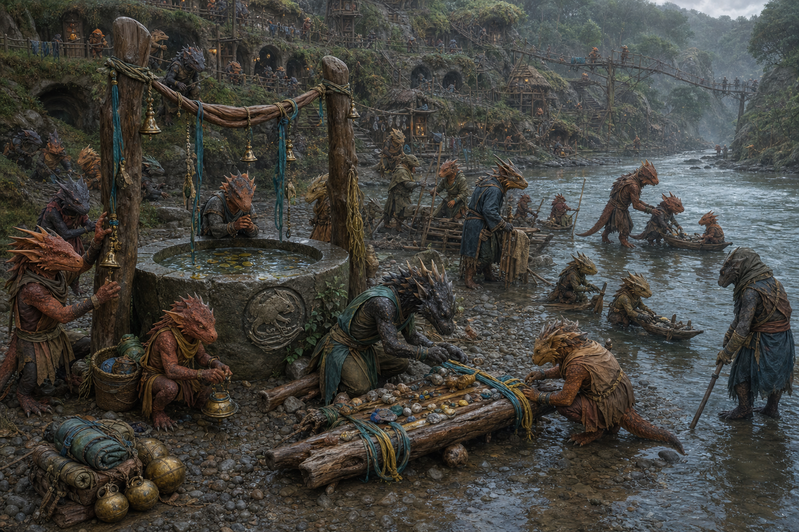

# Riverside Shrine

*Compiled by the College of Letters and Public Record, Free University of Thumping Waters, from visits to Sootscale Valley and conversations with Velka, Chief Kereek, the retired Chief Sootscale, Mek-Mek the Copperhand, Kikki the Reedwhisper, and Old Mother Thruppa*

> A river that never changes is a road someone has mistaken for water.
>
> — Velka

Velka's Riverside Shrine is a Hanspurite place of worship upon the waterline of Sootscale Valley. It consists of a carved stone basin, a stand of reeds, brass bells, driftwood posts, and a low landing from which small devotional rafts are released into the current. Travelers leave shells, coins, river-polished stones, scraps of rope, and bright trinkets in thanks for safe passage or in memory of the drowned.

The fixed structures are not considered the shrine's complete sacred center. At important observances, Velka and the people of the valley assemble a new shrine from driftwood and lash it into a little raft. After prayers and offerings, the raft is untied and allowed to choose its own course downstream. The permanent site is therefore best understood as a place where shrines begin rather than a temple intended to hold Hanspur in one location.

  

### At a Glance

**Type:** Riverside shrine and devotional launching place

**Faith:** Hanspur, the Water Rat

**Location:** Sootscale Valley

**Founder and Principal Priestess:** Velka of the Sootscale

**Caretakers:** Kikki the Reedwhisper and members of the Sootscale community

**Artisan:** Mek-Mek the Copperhand

**Holy Symbol:** A rat walking upon water

**Common Offerings:** Driftwood, bells, shells, coins, rope, river stones, and the names of the drowned

  

### Where the Reeds Bend

The shrine stands downstream from the principal dwellings of Sootscale Valley where a gravel bank opens between reeds and slow water. It lies near enough to the settlement for children and elders to reach without difficulty but beyond the busiest paths, workshops, and river crossings.

A waist-high stone basin marks the approach. Rain and river water collect within it, carrying whatever leaves, insects, reflected clouds, or windblown dust arrive without invitation. The basin is not kept polished. Velka says that water displayed without evidence of the world touching it has learned nothing.

Three driftwood posts rise beside the bank. Brass bells hang between them upon cords of river grass and treated leather. Their tones change with wind, damp, and the height of the water. Beyond the posts, a low landing provides space for bathing, launching boats, helping travelers ashore, and assembling the shrine-rafts.

  

### The Shrine That Leaves

Hanspur's faithful rarely attempt to confine the Water Rat within a permanent temple. Rivers move, borders change, boats depart, and travelers survive by recognizing when remaining still has become more dangerous than leaving.

Velka's shrine preserves this tradition through the *Current Shrine*, a small raft assembled from driftwood gathered without cutting a living tree. The raft bears a simple carving of a rat walking upon water. Blue, green, and gold cords secure shells, river stones, scraps of travel-worn rope, and written or carved remembrances.

The Current Shrine remains moored for several days while worshippers visit. No one is appointed to decide which offering is most valuable or which prayer deserves the center. When the launching day arrives, the cords are checked, the bank is cleared, and the raft is released without a chosen destination.

Finding a previous Current Shrine downstream is considered fortunate but does not give the finder ownership of its offerings. A damaged raft may be repaired and released again. One that has come apart naturally is left to the river unless its remains create a hazard to boats or wildlife.

  

### Hanspur as Velka Teaches Him

Velka teaches that Hanspur is neither tame nor needlessly cruel. He is the danger of the river and the knowledge required to survive it, the current that carries a traveler home and the flood that proves no wall possesses absolute authority.

Her instruction emphasizes three obligations: learn how to live from the river without exhausting it, protect river travelers from unnatural dangers, and never abandon someone who is drowning. She also teaches the Six River Freedoms and regards needless restrictions upon travel, speech, and survival with particular suspicion.

Velka's language of kindness and mercy is her own recognizable current within Hanspur's broader faith. Other Hanspurites may speak more often of freedom, danger, death, smuggling, or the price demanded by the water. Velka does not deny those aspects. She insists that anyone who understands drowning should become quicker to extend a hand.

  

### The Darker Current

Hanspurite history includes rites that reenact the Water Rat's murder by drowning. Some old cults sacrificed animals, criminals, captives, or isolated travelers to the river. Such practices made Hanspur's worship feared or forbidden in many lands and continue among extremists who treat terror as proof of devotion.

Velka rejects the drowning of an unwilling victim as a betrayal of Hanspur's command to save those in the water. The Sootscale shrine does not accept living sacrifice. Its rites confront drowning through rescue, remembrance, and voluntary symbolic immersion under supervision.

This position does not make Velka naive about her faith. She teaches the history openly, warns travelers that a holy symbol does not make every Hanspurite trustworthy, and refuses to conceal cruelty merely because its perpetrator calls it ancient tradition.

  

### Rites of the Riverside Shrine

  

#### The Traveler's Knot

Before a river journey, a traveler ties a short length of cord around one of the shrine posts and names the destination, the vessel, and the people expected to arrive. Velka or another worshipper checks the traveler's equipment, route, and swimming preparations before offering a blessing.

Upon returning, the traveler unties the cord and works it into the next Current Shrine. Cords left too long are not treated as proof of death. They remain until reliable news arrives or the river destroys them.

  

#### The Hand above Water

The shrine's most serious initiation is a controlled immersion called the Hand above Water. The participant enters calm water voluntarily while several swimmers and a rope team stand ready. After a brief submersion, the participant reaches upward and is immediately pulled to safety.

The rite commemorates Hanspur's drowning while reversing the act that created it: where a companion once murdered a traveler, a community now refuses to let one vanish beneath the water. No participant is restrained, surprised, intoxicated, or prevented from ending the rite before entering the river.

  

#### Names of the Drowned

At the dark of the moon, the bells are wrapped so that they sound only faintly. Worshippers speak the names of people lost to rivers, lakes, floods, and storms. A name may belong to a friend, enemy, stranger, or person whose identity was never discovered.

Each name is marked upon wood, clay, leaf, or paper and placed upon the Current Shrine. The observance does not claim that every drowned soul belonged to Hanspur. It acknowledges that the river remembers lives that official records may not.

  

#### The Driftwood Fleet

Children of Sootscale Valley race little driftwood boats through the shallows. The custom began as play and became an informal holy day under Velka's encouragement. Boats may be decorated with leaves, feathers, paint, nutshells, scraps of sailcloth, or objects their builders insist improve speed.

The first boat downstream receives applause. The last boat still afloat receives equal applause. Adults remain in the water during the race, ostensibly for safety and actually because interference, splashing, and allegations of divine favoritism are traditional.

  

#### The Wander

Devout Hanspurites may undertake a pilgrimage known as the Wander, traveling the waterways by foot and boat while living primarily upon what the river and honest exchange provide. The purpose is not to reach a particular shrine. It is to become attentive enough to discover a question the traveler did not know to ask.

Velka's journeys throughout the Republic share much with this practice. She visits settlements, tends riverside shrines, guides travelers, exchanges news, blesses working water, and forms friendships wherever the current carries her. She does not claim that every journey is a formal Wander, though other Hanspurites frequently assume otherwise.

  

### Offerings and Talismans

Offerings at the shrine are modest, portable, and resistant to water. Coins are accepted but rarely displayed for long; they are used for rescue rope, boat repairs, food for travelers, and the care of the riverbank. Shells, glass, polished stones, and bright metal are worked into shrine-rafts or returned to the water where doing so will not cause harm.

Velka is known for making talismans from driftwood, rope, shells, river glass, and scrap metal. These objects are blessings rather than guarantees. A charm hung above a forge, mill, boat, or doorway does not compel Hanspur to protect it. It reminds the bearer to respect water, prepare for danger, and extend help when another person is carried beyond their strength.

Rats are sacred to Hanspur and are neither driven from the riverbank nor encouraged inside food stores. The shrine's grain is kept in sealed containers. Velka describes this arrangement as a successful theological compromise.

  

### People of the Shrine

  

#### Velka of the Sootscale

Velka is the shrine's founder, principal priestess, and most frequent traveler. She learned faith through river survival rather than formal temple schooling and interprets Hanspur through movement, rescue, practical labor, and relationships formed along the water.

She does not reside permanently at the shrine. Her absence is not considered neglect. A Hanspurite priest who never leaves the bank would be difficult to distinguish from a post.

  

#### Kereek, Chief of Sootscale Valley

Kereek is the current chief of Sootscale Valley and holds civic authority over the riverbank upon which the shrine stands. He consults Velka on matters of faith, diplomacy, river use, and restraint. He does not pretend to share every element of her devotion, but he respects the shrine's importance to the valley and the practical value of its rescue training.

Kereek's support also protects the shrine from becoming Velka's private possession. Decisions affecting the riverbank, community safety, or relations with travelers remain matters for Sootscale Valley as a whole.

  

#### Sootscale, Retired Chief

Sootscale led the tribe through its conflict with Tartuk and the mites beneath the Old Sycamore and later helped establish the valley that bears his name. He has since retired from leadership but remains an influential elder and source of historical memory.

The retired chief trusts Velka more than most priests and continues to advise her on diplomacy and the responsibilities that accompany public reverence. He may grumble at her river parables, but he listens. His presence at major launchings signals continuity between the tribe's dangerous early years and the community Kereek now governs.

  

#### Mek-Mek the Copperhand

Mek-Mek the Copperhand is a one-armed kobold smith, talisman-maker, and childhood friend of Velka. He forged the brass bells that hang above the shrine and supplies scrap metal, wire, fittings, and small rat-shaped tokens for the Current Shrine.

Mek-Mek is not Mikmek, the kobold rescued during the conflict beneath the Old Sycamore. The similarity of their names has confused outside chroniclers more often than either kobold considers reasonable.

The Copperhand tests each bell at the forge and again at the river. He claims the first test determines whether the metal is sound and the second whether it has anything worth saying.

  

#### Kikki the Reedwhisper

Kikki the Reedwhisper is a young herbalist and Velka's apprentice in the overlap between rivercraft, healing, and faith. She gathers reeds and medicinal plants, maintains rescue supplies, records water levels, and cares for the shrine when Velka is traveling.

Kikki writes down Velka's prayers and parables, despite Velka's repeated warning that words captured upon a page may stop flowing. Her notebooks are becoming the most extensive surviving record of Velka's theology.

  

#### Old Mother Thruppa

Old Mother Thruppa is matriarch of the nursery warrens and claims to have pulled Velka from floodwater as a hatchling. Whether every detail of the story remains chronologically possible has not discouraged her from repeating it.

Thruppa brings children to the shrine, provides clam stew after cold-water rites, and asks Velka at regular intervals when she intends to build a proper temple. Velka's answer remains unchanged: the river has not built one either.

  

### Reflections and Signs

Hanspur is said to communicate through images reflected in river water. Such visions are rarely clear and may be confused with clouds, fish, lantern light, branches, exhaustion, desire, or fear. Velka cautions worshippers against turning every ripple into an instruction.

The bells are treated similarly. A sudden chime may be an omen, a change in the wind, a rising current, or a child pulling a hidden cord from the reeds. All four possibilities deserve investigation.

The shrine's tradition therefore values interpretation tested through action. A vision warning of danger should lead someone to check the boats, ropes, weather, and travelers. If the warning produces only an impressive story about the person who received it, Velka advises listening again.

  

### Place in Sootscale Valley

Velka's Riverside Shrine is both a religious site and a piece of community infrastructure. Rescue ropes, poles, blankets, lamps, and flotation gourds are stored near the landing. Children learn to swim there. Travelers exchange information about currents, obstructions, weather, damaged bridges, bandits, and safe camps.

The shrine has also become a meeting place between Sootscale Valley and the wider Republic. Riverfolk who might never enter the settlement's warrens know the bells and landing. They arrive for blessings, repairs, guidance, or remembrance and leave with a more complicated understanding of kobolds than they carried upstream.

> If you hear the bells, check the river. If you hear nothing, check anyway.
>
> — Mek-Mek the Copperhand
