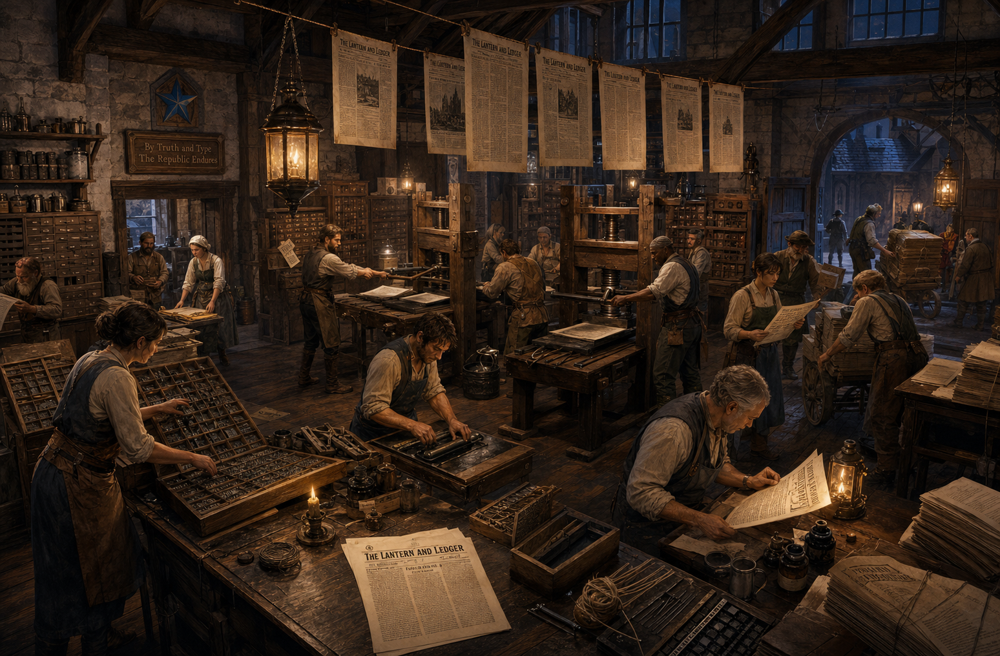

# Government Printing Office

*A guide to the presses, people, and public work behind the printed word in Thumpington, prepared from Ministry of Communication records and interviews with the printers*

  
> Everything looks official once it has margins. That is why we check the words twice.  
> —Ivena Rusk, Superintendent of Printing

  

The Government Printing Office is Thumpington's public print shop and one of the working institutions through which the Republic of Thumping Waters turns decisions into documents. Its presses produce laws, proclamations, forms, public notices, instructional pamphlets, maps, university papers, emergency broadsheets, and every issue of the *Lantern and Ledger*.

  

The office belongs to the Ministry of Communication, but its rooms serve several institutions. Government clerks bring approved copy for official publication. The staff of the *Lantern and Ledger* prepares editions under its own masthead. Scholars from the Free University submit lectures, field reports, translations, and practical manuals through the University Press. Citizens arrive at the public counter to purchase notices, collect forms, submit advertisements, or ask whether a particularly embarrassing error can be removed from every copy already distributed across the Republic. The answer to the final question is no.

  

### At a Glance

**Location:** Ministry Quarter, Thumpington

**Institutional Authority:** Ministry of Communication

**Minister Responsible:** Linzi

**Superintendent of Printing:** Ivena Rusk

**First Press Made Operational:** Approximately 4712 AR

**Dedicated Office Completed:** 4714 AR

**Associated Publication:** *The Lantern and Ledger*

**Academic Partner:** University Press of the Free University of Thumping Waters

**Principal Work:** Official printing, newspapers, public broadsheets, forms, maps, pamphlets, scholarly works, and limited private commissions

  

### From Recovered Machinery to Public Institution

The office began with machinery rather than a building. In 4711 AR, Linzi secretly used money from the national treasury to purchase the components of a printing press and hire Eobald, one of her former teachers in Pitax, to help assemble and operate it. The final caravan was ambushed, and both Eobald and essential components fell into the hands of the Jaggedbriar Coven. The Tubthumpers rescued him and recovered the machinery before either could be put to the purpose the hags intended.

  

Recovery did not produce a working press. The components had been damaged by weather, rough travel, ogres, and captors with no concern for alignment. Eobald worked with local metalworkers, carpenters, and patient apprentices to clean the machinery, reproduce missing pieces, establish supplies of ink and paper, and teach operators who had never before encountered movable type. Nearly a year passed before the press worked reliably.

  

The repaired machinery was first assembled in temporary government workrooms. Those quarters were sufficient for laws, proclamations, forms, and small batches of public notices, but they offered little storage and less room for expansion. Sheets dried wherever a horizontal surface could be defended from clerks. Type cases occupied corridors. Paper deliveries blocked doors with a regularity that government memoranda failed to correct.

  

A dedicated printing office was completed in 4714 AR as the Ministry of Communication prepared to support a regular newspaper. The machinery, workers, type, and accumulated institutional knowledge moved into the new building. On Sarenith 1 of that year, its presses produced the first issue of the *Lantern and Ledger*, led by the report *Speartooth Slain in the Western Hills*.

  

### The Building

The Government Printing Office is a broad, practical building of stone and heavy timber in the Ministry Quarter. Tall windows provide working light to the composing room, while the press hall rests upon a reinforced floor built to withstand the repeated movement of the machinery. Delivery doors open toward a service court where carts bring paper, lampblack, oil, replacement timber, metal type, and the meals required whenever an urgent edition keeps the staff at work through the night.

  

The building bears a carved blue star above its public entrance, identifying it as property of the Republic. Beneath it hangs a simpler sign showing a hand press and an open sheet. During major events, citizens often gather outside before any notice has been posted. Printers maintain that the speed with which a crowd assembles is inversely related to the amount of confirmed information available.

  

#### The Public Counter

The front room serves citizens, messengers, advertisers, and government clerks. Current proclamations and emergency notices are posted upon an exterior board and repeated inside for those who suspect the weather of political editing. Standard forms may be collected here, while requests for printed notices, handbills, invitations, and small private commissions are entered into the production ledger.

  

Advertisements and letters intended for the *Lantern and Ledger* may also be submitted at the counter, although acceptance by a clerk does not guarantee publication. Neither does underlining a request three times, attaching baked goods, or explaining that the matter will interest every reader in the Republic.

  

#### The Composing Room

Cases of movable type cover the composing room's long walls. Compositors assemble text backward, line by line, into forms that can be carried to the presses. Copy stands hold government orders, reporters' drafts, university manuscripts, and corrections written in several distinct hands. The work requires literacy, precision, strong memory, and the ability to remain calm while another person asks whether the press is nearly ready.

  

Separate cabinets hold commonly used headings, seals, borders, forms, and recurring notices. The words *Republic of Thumping Waters* occupy more type than anyone anticipated when the nation's name was selected. Printers have resisted every suggestion that official documents simply use smaller letters.

  

#### The Press Hall

The oldest machine is known formally as the First Press. It incorporates many of the components recovered with Eobald and remains the symbolic heart of the office. Later presses have been built or purchased as the Republic's needs expanded, but the First Press is still used for inaugural sheets, commemorative editions, and work whose sponsors insist that history improves the impression.

  

The hall is loud during production. Press crews ink the forms, position paper, pull the mechanism, lift each sheet, and pass it onward for inspection and drying. A bell marks the start of a major run and sounds again when the approved first sheet is produced. On newspaper nights, the rhythm of the presses can be heard beyond the service court and sometimes continues until dawn.

  

#### Paper Stores, Ink Room, and Drying Loft

Paper is the office's greatest recurring expense and one of its most closely watched supplies. Bundles are stored above the damp of the street and separated by size, weight, and intended use. Official records receive durable stock when available; temporary notices and advertisements receive whatever can survive distribution long enough to be read.

  

Ink is mixed and stored in a smaller room whose occupants can be identified throughout the city. Recipes vary by season and purpose, but dependable black ink remains the foundation of the office. Colored work is possible in limited quantities and is usually reserved for seals, diagrams, formal invitations, university plates, or editions for which the expense has already survived an encounter with the Ministry of the Treasury.

  

Fresh sheets hang or lie upon racks in the drying loft before passing to the finishing tables. There they are folded, gathered, stitched, cut, bundled, or bound according to need. Misprints are retained for scrap, packing, training, and internal notes. Employees are forbidden from selling them as rare variant editions, a regulation specific enough to possess a history.

  

#### Editorial and Proof Rooms

The *Lantern and Ledger* maintains editorial rooms above the public floor. Linzi, Mara Venn, and the newspaper's correspondents prepare copy there before it enters the composing room. The separation is administrative as well as physical: the newspaper uses public machinery, but it maintains its own masthead, bylines, editorial decisions, and corrections policy.

  

A long table in the principal proof room receives the first impressions from important jobs. Official documents are checked against authorized copy. Newspaper pages are reviewed for errors, missing lines, reversed blocks, misplaced illustrations, and headlines whose size has become more enthusiastic than the evidence beneath them. University work is returned to its editors whenever a footnote threatens to become longer than the page that contains it.

  

### Work of the Office

Government printing has first claim upon the office during emergencies and at legally required times. Laws, council decisions, tax instructions, military warnings, public-health notices, construction orders, court forms, and proclamations enter the production schedule through the Ministry of Communication. Restricted material is handled separately and does not pass through the public counter or ordinary editorial rooms.

  

The *Lantern and Ledger* publishes several regular editions each month, supplemented by special editions and urgent broadsheets. Its staff controls the contents of the paper, while the printing office controls the practical questions of type, paper, press time, and whether a late revision can physically be included without beginning the entire page again.

  

The University Press shares the equipment and distribution network by agreement with the Ministry of Communication. It publishes lectures, translations, maps, catalogues, field reports, scholarly papers, and practical manuals prepared through the Free University. Printing a university work does not make its conclusions official government policy, a distinction stated prominently after several readers began treating footnotes as decrees.

  

When capacity permits, the office accepts civic and private commissions. Festival programs, guild rules, auction bills, memorial notices, instructional leaflets, menus, and public letters all pass through its ledgers. Work may be refused if it is fraudulent, dangerous, unlawfully defamatory, impossible to complete by the requested date, or written in a hand no compositor can decipher.

  

### People of the Press

#### Ivena Rusk, Superintendent of Printing

Ivena Rusk directs the physical operation of the office. A former clerk who joined the first group trained upon the repaired press, she learned every stage of production before assuming responsibility for schedules, supplies, apprentices, safety, and the approval of final press forms. She is neither the editor of the newspaper nor the author of government policy. Her authority begins when words must become ink upon paper, at which point ministers and editors alike discover that she controls the timetable.

  

#### Eobald, Consulting Printer

Eobald transformed the recovered components into a working press and trained the office's earliest operators. He does not manage its daily work, but he remains a welcome technical adviser and an honored—if occasionally theatrical—visitor. His association with the press is also recognized by Eobald Hall at the Free University, home of the College of Letters and Public Record.

  

The office keeps several of Eobald's original alignment notes in a cabinet near the First Press. Later printers have added comments, corrections, measurements, and one unflattering sketch whose continued preservation is defended as a matter of archival integrity.

  

#### Compositors, Press Crews, and Apprentices

The permanent staff includes compositors, press operators, proofreaders, ink makers, binders, woodcutters, clerks, porters, and apprentices. Some entered through government service; others came from craft workshops, the university, military clerical offices, or settlements where reliable literacy was more common than formal credentials.

  

Apprentices rotate through the principal rooms before choosing a specialty. They learn that a compositor's error can change a law, that a press operator's haste can ruin a day's paper, and that a proofreader who prevents either mistake has performed a public service even when nobody learns their name.

  

### Fire, Security, and Custody

A building filled with paper, oil, dry timber, and deadlines requires strict precautions. Open flames are prohibited in production and storage rooms. Hooded lamps are fixed in designated places, water and sand stand ready throughout the building, and heating stoves are inspected more frequently than their users consider reasonable. At closing, two employees walk the rooms together before signing the fire ledger.

  

Official seals, restricted forms, unfinished proclamations, and sensitive printing plates are stored in locked cabinets. Jobs concerning military movements, active investigations, or unreleased council decisions use controlled copy and recorded chains of custody. Waste sheets from such work are pulped or burned under supervision rather than joining the ordinary scrap pile.

  

These controls are intended to prevent theft and premature disclosure, not to conceal the existence of ordinary government work. Once a law or proclamation becomes public, copies are posted, distributed, archived, and made available through the front counter. The office was founded to make the public record harder to alter, lose, or quietly forget.

  

### The Office in Thumpington

The Government Printing Office changed the sound and speed of the capital. Before the press, news and law traveled through handwritten copies, heralds, messengers, tavern accounts, and Linzi's journals. Printed sheets did not eliminate rumor, error, or argument, but they gave citizens a common text about which to disagree.

  

Important broadsheets draw crowds to the posting board. Couriers collect bundles for distant settlements. Scholars wait for papers that will carry their work beyond university halls. Merchants negotiate advertisements. Families submit memorial notices. Children from Tristian's Dawn sometimes visit as part of their lessons, returning with ink upon their fingers and ambitious proposals for publications of their own.

  

The office's work is visible across the Republic even to people who never enter it. A tax form in Olegton, a warning posted in Willowfen, a university map carried toward Candlemere, and a newspaper passed between travelers at the White Lantern may all have begun as separate lines of backward type in the same Thumpington room.

  

### Customs and Particularities

- **The First Sheet:** The first acceptable sheet of a major edition is signed by the press crew and retained in the office archive. Printers insist this is institutional practice rather than collective superstition.
- **The Bell:** One bell announces the beginning of an important run; two announce an approved first sheet; repeated ringing usually means either a special edition or that somebody has misunderstood the custom during an emergency.
- **The Proof Wall:** Memorable errors are pinned in a staff room as instruction and warning. Access is restricted whenever a visiting minister appears likely to recognize their own name.
- **Ink Hands:** New apprentices are told that the stains eventually fade. Experienced printers no longer make promises concerning when.
- **Passed-On Papers:** The *Lantern and Ledger* encourages readers to pass editions onward. Printers regard a worn copy read by twenty citizens as more successful than a perfect copy kept unread upon a shelf.

  

### Legacy

The Government Printing Office began with an unlawful expenditure, a broken caravan, a rescued teacher, and machinery that required nearly a year of work before it could produce a dependable page. It became a tool of administration before it became the home of a newspaper. In time, it also became part of the Republic's educational, commercial, and cultural life.

  

Its importance lies less in the presses themselves than in what their repeated labor makes possible: laws citizens can compare, warnings that can travel faster than rumor, scholarship that can leave the capital, names that can be preserved, and public decisions that remain visible after the speaker has left the room.

  
> A government may speak in a council chamber. A country begins to hear it when somebody sets the type.  
> —Mara Venn, Managing Editor of the *Lantern and Ledger*
