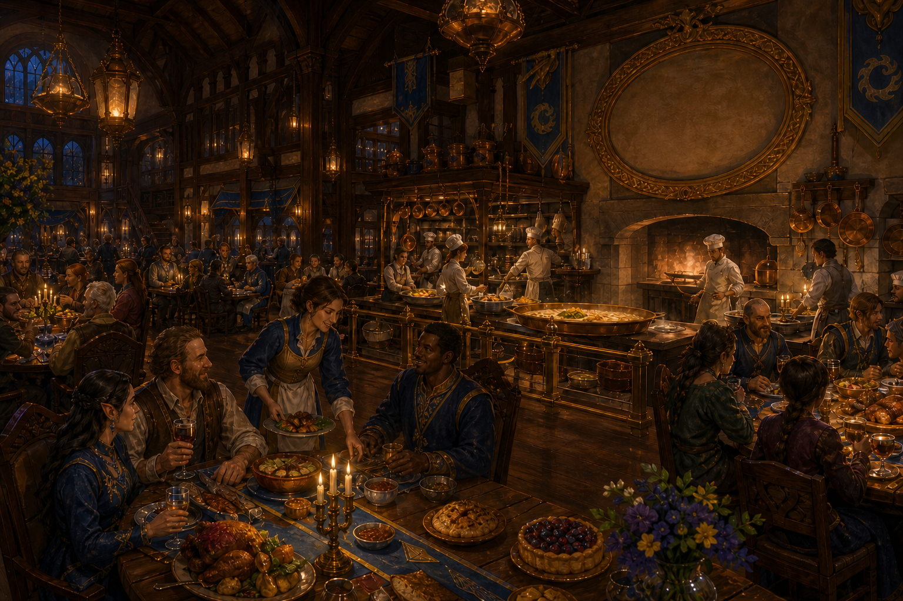

# Roc's Omelette

*Compiled by Sella Copperclaw, Trade and Civic Affairs Correspondent, with records supplied by the Ministry of Communication and interviews with Jamery Gerbasken*

> The original omelette is gone. The argument about what should have been put in it continues.
>
> — Jamery Gerbasken

The Roc's Omelette is a fashionable tavern and dining house in Thumpington founded by the cook Jamery Gerbasken. It takes its name from the enormous roc egg recovered intact from Talon Peak by the Tubthumpers in 4714 AR. Gerbasken used the egg for a public culinary competition whose cooks, spectators, merchants, and astonishing appetite brought enough prosperity to establish the tavern without drawing upon the Republic's ordinary construction reserves.

The establishment has since become known for elaborate meals, civic celebrations, private parties, and the conviction that dining should occasionally provide a story worth repeating. Despite its name, no current dish contains genuine roc egg. Gerbasken regards acquiring another as financially irresponsible, ecologically questionable, and extremely hard on the roof.

  

### At a Glance

**Type:** Luxury tavern and dining house

**Location:** Thumpington

**Founded:** 4714 AR

**Founder and Proprietor:** Jamery Gerbasken

**Named For:** The Talon Peak roc egg

**Known For:** Elaborate meals, culinary exhibitions, private celebrations, and competitive cookery

**Original Patronage:** Established from the prosperity generated by the Great Omelette Competition

**Genuine Roc Egg Currently Served:** No

  

### Jamery Gerbasken's Request

The Roc's Omelette began before the tavern possessed a building. Jamery Gerbasken was already known in the young Republic for culinary enthusiasm intense enough to resemble professional obsession. He proposed preparing an entire omelette from a single roc egg and inviting the Republic's finest cooks to compete over its fillings, accompaniments, and presentation.

The plan had one significant weakness: roc eggs were not available from respectable grocers. Travelers from Varnhold had reported an enormous bird nesting in the ruined watchtower atop Talon Peak. Gerbasken therefore asked the government whether the Tubthumpers might retrieve one egg intact.

The word *intact* proved important. An ordinary expedition could have returned with shell fragments, an account of an inaccessible nest, or several persuasive reasons why the cook should revise his menu. Gerbasken required an egg capable of reaching a kitchen rather than merely demonstrating that rocs existed.

  

### The Talon Peak Expedition

The Tubthumpers departed on 17 Abadius, 4714 AR. The journey became increasingly difficult as the land rose toward Talon Peak, where a ruined watchtower stood above several hundred feet of regrettable open air. They reached the summit on the twenty-first and found three enormous eggs within the roc's nest.

They also found their mother.

The roc struck before the company could secure the nest. It carried Matteo and Antson Crazyfoot into the sky while Ally Grainger and Mairi pursued it through the air and Seamus fought from the broken tower below. The battle ranged across clouds, crumbling stone, and the narrow summit.

Mairi finally knocked the roc helpless in midair. The creature fell approximately two hundred and fifty feet with Ant still caught in its claws. Mairi dove after them and reached the rocks below in time to stop Ant from bleeding to death. The roc did not survive the impact.

Each egg weighed approximately two hundred pounds. A *Shrink Item* spell reduced one to a transportable size, allowing the Tubthumpers to fulfill Gerbasken's request without requiring a wagon designed for giants. The egg reached Thumping Waters intact.

  

### The Great Omelette Competition

Gerbasken invited cooks from across the Republic to help determine what belonged inside an omelette of unprecedented size. They arrived with cheeses, peppers, herbs, sausages, preserved vegetables, spice mixtures, and culinary opinions strong enough to require official mediation.

The event quickly exceeded the scale of a cooking contest. Spectators came to see the egg and watch the preparation. Farmers, brewers, merchants, musicians, and food sellers supplied the crowd. Visitors stayed in local inns and spent money throughout the capital. The competition became a festival whose economic consequences lasted considerably longer than its centerpiece.

No single surviving account records every ingredient used in the final omelette. This may reflect the disorder of the preparation, the number of participating cooks, or a deliberate choice by losing competitors to dispute the result indefinitely. Gerbasken maintains that the recipe was less important than the cooperation required to cook something no single kitchen could manage.

The celebration brought enough trade and profit for Gerbasken to establish a permanent luxury tavern without requesting material from the Republic's construction reserves. He named it for the dish that financed it.

  

### The Dining House

The Roc's Omelette combines a public tavern with a more formal dining house. Its front rooms receive ordinary evening trade, while reservable chambers accommodate celebrations, visiting delegations, business dinners, and private gatherings whose participants would prefer that the neighboring table not take notes.

The principal dining room has a high ceiling, broad tables, polished copper pans, dark timber, and blue-and-gold details drawn from the colors of Thumping Waters. An ornamental oval above the hearth marks the approximate circumference of the original egg. Gerbasken refuses to hang a genuine shell fragment there, since every fragment offered for sale has so far proved to come from a goose, an unusually optimistic chicken, or pottery.

The kitchen was designed for exhibition as well as production. During special meals, guests may watch cooks work from a safe distance. The phrase *safe distance* was added to the house rules after an early patron attempted to assist with a flaming pan because the evening appeared insufficiently adventurous.

  

### Food and Drink

Gerbasken's cooking favors familiar ingredients treated with unusual care rather than rarity for its own sake. The kitchen purchases grain, vegetables, herbs, dairy, meat, fish, beer, and spirits from producers throughout the Republic. Seasonal menus allow visiting cooks and newly available ingredients to change the house's offerings without requiring every successful experiment to become permanent.

Egg dishes remain prominent for reasons of reputation, although they use eggs obtained from domesticated birds and other lawful suppliers. The *Talon Peak Omelette* is prepared for an entire table with a choice of seasonal fillings. The *Three Eggs Service* presents three smaller preparations using different techniques, accompanied by an explanation that becomes more theatrical when Gerbasken delivers it personally.

The establishment also serves roasts, river fish, savory pies, vegetable dishes, breads, cheeses, and elaborate desserts. Guests who object that these foods have nothing to do with rocs are reminded that the original event included an entire festival and not merely breakfast.

The wine and spirits list is selected for food rather than prestige alone. Local beer remains available, partly because Gerbasken understands his city and partly because any Thumpington tavern refusing beer would become the subject of immediate legislative interest.

  

### Service and Reputation

The Roc's Omelette is expensive by Thumpington standards, but it is not restricted to nobles, ministers, or foreign dignitaries. Craftspeople, soldiers, merchants, scholars, and prosperous families reserve tables for important occasions. Gerbasken expects clean clothing and reasonable conduct rather than inherited status.

Service is polished without being silent. Staff are expected to know the food, explain unfamiliar preparations, and recognize when diners want ceremony and when they merely want supper. New servers learn the history of Talon Peak because visitors ask for it constantly and because Gerbasken considers an inaccurate version more offensive than spilled wine.

The tavern's fame attracts exaggeration. It has never maintained a breeding pair of rocs beneath the cellar, does not possess a second egg preserved for emergencies, and cannot prepare a genuine roc omelette for guests willing to pay enough. The kitchen has issued these clarifications often enough to keep them near the reservation book.

  

### Celebrations and Public Life

The establishment occupies an unusual place between public monument and private business. Its name recalls an expedition in which Ant nearly died, yet the legacy of that danger became a shared meal, a successful festival, and a durable civic institution. The story is characteristic of Thumping Waters: terrifying wilderness made into public memory through work, argument, commerce, and food.

The Roc's Omelette hosts wedding dinners, anniversaries, visiting delegations, guild celebrations, university gatherings, and private parties. Its best-known recent event was Linzi's final unmarried evening before her wedding to Seamus. Her companions gathered at the tavern while Seamus endured a separate Stag Night presided over by Annamede Belavara.

Gerbasken does not disclose the details of private celebrations. This policy has strengthened the tavern's reputation considerably more than disclosure would have done.

  

### Economic Legacy

The tavern is frequently cited by merchants and officials as an example of public adventure producing unexpected private enterprise. The Republic did not build the establishment. Its heroes recovered the egg, Gerbasken organized the competition, cooks and suppliers created the event, and visitors provided the trade that allowed a permanent business to follow.

The story is also used as a warning against treating every fortunate outcome as a repeatable development policy. Thumping Waters does not maintain an official program of provoking enormous flying predators to stimulate hospitality spending.

For Gerbasken, the legacy is simpler. The original omelette proved that a meal could gather cooks and diners who would never otherwise have shared a table. The tavern exists to attempt that achievement again on a scale less likely to require aerial combat.

  

### From Linzi's Journal: The Egg

*A roc is not merely a large bird. It is a storm with feathers, talons large enough to close around a person, and the disconcerting habit of treating armed adventurers as portable meals.*

The Tubthumpers climbed Talon Peak because a cook wanted an egg. This sounds ridiculous until one remembers that roads, newspapers, alliances, and half the Republic began because someone asked for something that sensible people considered impossible.

Ant fell two hundred and fifty feet. Mairi dove after him. They returned carrying an egg that weighed more than several members of the government combined.

Then Gerbasken invited everyone to argue about cheese.

I cannot decide whether this was disrespectful to the danger or the finest possible answer to it. I suspect it was both, which is how Thumping Waters handles most things worth remembering.

—Linzi

  

### Visiting the Roc's Omelette

- **Reservations:** Recommended for evening meals, private rooms, and festival periods.
- **Dress:** Clean and presentable clothing is expected; formal attire is not required.
- **Private Events:** Available by arrangement, with menus planned according to the occasion and budget.
- **Dietary Requests:** Best discussed when reserving, particularly for large groups or experimental menus.
- **Roc Egg:** Not available.

  
> We serve people who want a memorable evening. Nearly dying on a mountain is no longer included in the price.
>
> — Jamery Gerbasken
