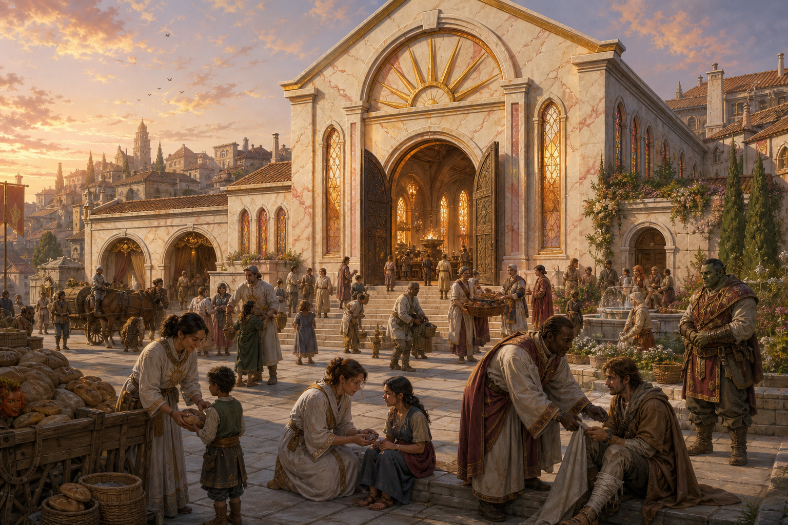

# Temple of the First Light

*Compiled by the College of Letters and Public Record, Free University of Thumping Waters, with the cooperation of the clergy of First Light*

> Come as you are. Dawn has never required the night to explain itself.
>
> — Words carved above the sanctuary doors

The Temple of First Light, formally the *Temple of First Light, Sanctuary of the Dawnflower*, is the principal temple of Sarenrae in Thumpington. Commonly called *First Light*, it serves simultaneously as a house of worship, healing sanctuary, relief center, school, public kitchen, and place of counsel.

Tristian helped establish First Light during the capital's early growth and shaped its central conviction: compassion must be made practical. The temple became especially important after the Beast's attack, when its halls sheltered the displaced and its clergy helped organize the long recovery. It remains closely connected to Tristian's Dawn, the children's home and school founded during that reconstruction.

  

### At a Glance

**Formal Name:** Temple of First Light, Sanctuary of the Dawnflower

**Common Name:** First Light

**Faith:** Sarenrae

**Location:** Thumpington

**Founder:** Tristian, with the support of Thumpington's early Sarenite community

**Current Rector:** First Dawnpriest Samira Veyd

**Associated Institution:** Tristian's Dawn

**Known For:** Healing, relief, redemption, education, and dawn services

  

### Founding

Tristian came to the Stolen Lands under the guidance of dreams and briefly traveled with the Tubthumpers during their campaign against the Stag Lord. After the founding of Thumpington, he returned as a priest, healer, and counselor. What began as regular worship and healing offered from borrowed rooms grew with the settlement.

The first permanent sanctuary was built through donations, volunteer labor, and support from citizens who had relied upon Tristian's ministry during the difficult frontier years. It was never intended solely for Sarenites. From its beginning, the temple's kitchens, infirmary, and counseling rooms served anyone in need without requiring conversion.

First Light expanded dramatically after the Beast's attack. Its nave became an emergency dormitory, its courtyard a field kitchen, and its clergy coordinated food, medicine, missing-person records, and temporary housing. Reconstruction added permanent relief facilities instead of returning the temple to its earlier, smaller form.

  

### The Name

The name *First Light* refers to the moment when darkness first becomes distinguishable from the coming day. Sarenite teaching treats that moment as a promise rather than a denial: night occurred, suffering matters, and nevertheless another future has begun to become visible.

The formal addition *Sanctuary of the Dawnflower* identifies the temple's faith and emphasizes its legal and customary role as a place of refuge. In ordinary speech, citizens say simply *First Light*.

  

### Architecture

First Light is built from pale local stone warmed by veins of gold and rose. Its eastern facade faces a broad public square, allowing the rising sun to strike the sanctuary doors and upper windows. A sunburst of seven long rays crowns the entrance without rising so high that it dominates the surrounding neighborhood.

The main sanctuary is bright, open, and deliberately uncluttered. Tall windows of amber, rose, and clear glass cast bands of color across the floor at dawn. Braziers burn with enduring flame along the central aisle, while a larger flame before the altar is kindled each morning from coals preserved through the night.

The temple complex extends beyond the sanctuary. It contains an infirmary, kitchens, public dining room, classrooms, bathing rooms, counseling chambers, clergy quarters, storerooms, and several small courtyards. A covered passage connects the relief wing to a sheltered carriage entrance so injured or frightened visitors need not cross the public nave.

  

#### The Hall of Returning Light

The Hall of Returning Light is the temple's principal infirmary. Its healers combine divine magic with ordinary medicine, sanitation, rest, and long-term care. Treatment is provided according to need. Those able to contribute may donate money, supplies, or later service, but payment is not a condition of emergency care.

  

#### The Common Table

The public dining hall is known as the Common Table. It serves a simple midday meal and expands during shortages, disasters, or the arrival of displaced families. Everyone eats from the same kitchen. Clergy, council members, laborers, and people seeking aid may therefore find themselves sharing a bench without anyone being placed in a separate charitable queue.

  

#### The Quiet Court

A small inner courtyard contains a fountain, flowering herbs, and stone benches protected from the street. The Quiet Court is used for private conversation, mourning, prayer, and the difficult silence that sometimes follows survival. Speaking is not required.

  

### Worship at First Light

The principal daily service begins shortly before sunrise. The sanctuary remains dim while prayers acknowledge grief, fear, wrongdoing, and the limits of mortal understanding. As daylight reaches the eastern windows, the morning flame is kindled and the congregation turns toward the light.

Services emphasize honesty, healing, justice, and the possibility of redemption. First Light does not teach that forgiveness erases consequences or obliges victims to resume dangerous relationships. Repentance must be demonstrated through changed conduct, restitution where possible, and acceptance of boundaries imposed for the protection of others.

Visitors are welcome to attend without declaring themselves members of the faith. The temple also maintains private spaces for followers of other gods who require quiet during a crisis and works regularly with Caydenite, Shelynite, Erastilian, and other congregations within the Republic.

  

### Healing and Relief

First Light is one of Thumpington's principal providers of healing. Its clergy treat disease, injury, exhaustion, and the effects of magical harm. Complex cases may involve the Ministry of Magic, other temples, independent physicians, or scholars from the Free University.

Relief work is coordinated through the temple's kitchens, storerooms, and household assistance office. Aid may include meals, medicine, fuel, clothing, temporary lodging, burial expenses, transportation, or direct assistance that allows a struggling family to remain together.

The temple's records distinguish poverty from wrongdoing. First Light does not remove children from safe families merely because those families require help. This principle became central to the later work of Tristian's Dawn.

  

### Redemption and Protection

Sarenrae is a goddess of redemption and also a defender against cruelty. First Light offers counsel, supervised restitution, mediation, and structured opportunities for people sincerely attempting to change. It does not promise that every offense can be repaired or that public safety must wait indefinitely for repentance.

The temple's redemption work is coordinated with the Ministry of Justice when crimes are involved. Clergy may advocate mercy, but they do not possess authority to conceal offenders, nullify lawful judgments, or demand reconciliation from victims. The distinction is taught explicitly to novices.

First Light's protective clergy train to defend patients, residents, worshippers, and relief supplies. Weapons are kept discreetly but not apologetically. The Dawnflower's scimitar represents the responsibility to confront harm when compassion alone cannot stop it.

  

### People of First Light

  

#### Tristian

Tristian is First Light's founder and most widely known priest. His service as Minister of Magic prevents him from directing its daily administration, but he continues to conduct services, heal, teach, and advise the clergy. His financial support helped establish Tristian's Dawn after the Beast's attack.

The manifestation of Tristian's golden wings during Velka's resurrection has made First Light an important center for questions concerning his angelic nature. The temple treats the event as a witnessed miracle without claiming certainty about every conclusion that might be drawn from it.

  

#### First Dawnpriest Samira Veyd

Samira Veyd is a human priest of Sarenrae and the rector responsible for First Light's daily governance. She first came to Thumpington as a traveling healer and remained after the Beast's attack, during which she organized the sanctuary's infirmary shifts and missing-person records.

Samira is composed, practical, and resistant to charitable pageantry. She expects accounts to balance, kitchens to remain supplied, healers to rest before exhaustion makes them dangerous, and prominent visitors to wait when a patient has greater need. Tristian selected her to lead the temple precisely because she is willing to disagree with him.

  

#### Hearthwarden Oren Pell

Oren Pell is a broad-shouldered human lay priest who directs the Common Table, relief stores, and emergency shelter. A former caravan cook, he understands food as both logistics and welcome. He keeps careful inventories, purchases heavily from local farms, and maintains sealed reserves intended for siege, flood, fire, or magical disaster.

Oren is famous for remembering what visitors ate during earlier stays and for refusing to describe any meal as *only soup*. He coordinates regularly with Varka Stonekettle at Tristian's Dawn.

  

#### Dawnblade Kalessa Marr

Kalessa Marr is a half-orc champion of Sarenrae responsible for sanctuary protection, escorting healers into dangerous areas, and supervising the temple's redemption work with violent offenders. Her approach combines patience with clearly stated limits.

Kalessa teaches that mercy offered without protection can become another burden placed upon the vulnerable. She trains clergy and volunteers in evacuation, de-escalation, defense, and the secure movement of medicine and food during unrest.

  

### Tristian's Dawn

Tristian's Dawn operates under the religious protection of First Light while retaining its own House Council and day-to-day authority. The temple supplies healers, funding, food, clergy, volunteers, and emergency support. It does not control every educational or placement decision.

Dawnwarden Amaya Qadir directs the children's home. Brother Corren Voss coordinates its infirmary with the Hall of Returning Light, while Sister Branna Freecup represents Caydenite involvement and the interests of the residents themselves.

The relationship reflects First Light's broader conviction that religious sponsorship should create dependable support rather than ownership over the people receiving it.

  

### The Temple and the Republic

First Light is influential but is not the official religion of Thumping Waters. Its clergy possess the same rights and obligations as other religious communities and do not hold civil authority merely by virtue of ordination.

Tristian's simultaneous roles as priest and Minister of Magic require particular care. Temple accounts are kept separate from ministry funds, and First Light does not receive automatic control over religious or magical policy. When the temple petitions the government, its requests enter the public record like those of other institutions.

In practice, cooperation is frequent. First Light works with the ministries during disasters, curse outbreaks, magical emergencies, refugee arrivals, and public-health threats. Its independence allows the clergy to assist the government without becoming merely another government office.

  

### Customs and Observances

  

#### The First Flame

Each morning, the youngest willing participant in the dawn service helps kindle the altar flame. The role is not restricted to children or members of the faith; *youngest* refers to the person newest to First Light's community that morning.

  

#### The Open Door Meal

On the first Sunday of each month, the Common Table serves an evening meal funded entirely by voluntary offerings collected during the preceding weeks. The sanctuary doors remain open until the meal ends, and no sermon is required in exchange for a place.

  

#### Night Coals

A small watch preserves coals from the sanctuary flame through the night. Citizens facing illness, bereavement, childbirth, or a vigil may request a lamp kindled from these coals. The lamp is returned or allowed to burn out naturally; extinguishing it is not considered an omen.

  

### Legacy

First Light helped define what a major religious institution could become in the Republic. It is a temple without being only a sanctuary, a healer without being only an infirmary, and a charitable institution that attempts to preserve the agency of those it serves.

Its greatest influence may be visible in the expectations it created. Citizens now assume that a wealthy temple should feed people during scarcity, open its doors during disaster, account publicly for donated funds, and treat compassion as work requiring preparation.

> The sun rises freely. Our task is to make certain its light reaches someone who cannot yet reach the window.
>
> — First Dawnpriest Samira Veyd
