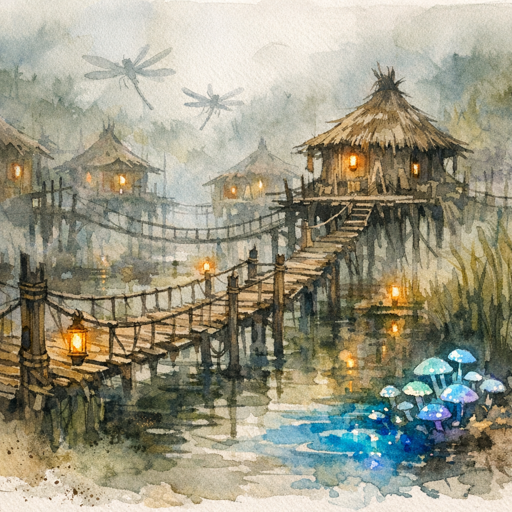

# Tok-Nikrat

# Tok-Nikrat

In the mist-choked waters of the [Hooktongue Slough](../../../Hooktongue%20Slough/Hooktongue%20Slough.md), where dragonflies skim black water and the reeds whisper with every passing wind, stands the growing settlement of Tok-Nikrat—home of the bog striders and one of the strangest communities in the Republic of Thumping Waters. Once little more than a cluster of stilted huts raised above the marsh, Tok-Nikrat has steadily transformed into a thriving frontier town where bog striders, gnomes, traders, hunters, soldiers, and wandering swampfolk now live side-by-side upon one of the few stable islands in the central marsh.

The settlement rises from the waters on woven stilts of reedwood and drift timber, connected by elevated walkways, rope bridges, and weather-darkened boardwalks slick with mist and rain. Protective wooden walls now ring much of the island, while watch platforms overlook the surrounding marshes. The bridge known as Talk-Kor connects the settlement to the mainland, and a watchtower on the western edge keeps wary eyes fixed upon the deeper swamp beyond. At night, pale blue fungus glows beneath the walkways while floating lanterns drift lazily across the water like fallen stars.

Though still modest in size, Tok-Nikrat now boasts several dozen structures scattered between the central island, the waterfront district, and clusters of raised homes overlooking the marsh. The town’s busiest district lies along Black Reed Pier, where flatboats, fishing skiffs, and marsh barges gather beneath hanging lanterns and dripping nets. The harbor master, a patient bog strider named Slanik, oversees traffic along the docks with the slow calmness common to his people.

Several businesses now thrive upon the pier. Crooked Reed, a bait and tackle shop run by the bog strider Nazzik, supplies hooks, fishing spears, marsh bait, and advice of questionable usefulness. Nearby, Hook Tongue Runners offers guided tours deeper into the swamp aboard narrow skimmer boats piloted by Kra-Torr, whose stories about the slough grow less believable with every retelling. Morak’s Wears serves as the settlement’s general store, carrying rope, lantern oil, dried fish, travel gear, and the occasional item no one can quite explain how Morak acquired.

Farther from the waterfront sits Fizzlebog Apothecary and Reagents, a cluttered alchemical workshop operated by the gnome Talli Bristlefen. Talli specializes in volatile concoctions designed to deal with the giant dragonflies that plague the marsh, and her establishment bears two signs near the entrance. The first reads: “Ask Before Opening.” The second, hanging directly beneath it, reads: “No Really.” Locals note that Talli is missing three fingers on one hand and consider this warning sufficient.

Travelers visiting Tok-Nikrat often find themselves spending evenings at either of the settlement’s two inns. The Whispering Step remains a favored stop for traders, scholars, and rangers brave enough to map the deeper swamp, while the increasingly popular Apple Boots Bar and Tavern has become something of a local landmark near the pier. Operated by the gnomes Apple Bottomjeans and Boots Witherfur, the tavern is loud, welcoming, perpetually crowded, and famous for serving swamp spirits potent enough to “remove unnecessary memories,” according to Boots himself.

At the center of the settlement stands Tok-Nikrat Town Hall, where Tok-Tekt—the aging bog strider warrior who first allied his people with the republic—still serves as Speaker of the Waters. Beside the hall rises Floodroots Sanctuary, a broad marsh-temple dedicated primarily to [Gozreh](../../../../../../../Rules/Deities/Gozreh.md), though shrines to [Hanspur](../../../../../../../Rules/Deities/Hanspur.md), [Erastil](../../../../../../../Rules/Deities/Erastil.md), the Green Faith, and several other faiths stand within its reed-woven halls. Surrounding the sanctuary is Murkwillow Hollow, a sacred grove of marsh trees, lantern-lit paths, picnic tables, benches, and softly glowing street lamps where residents gather for worship, festivals, and quiet reflection beside the water.

The story of Tok-Nikrat’s founding remains deeply important to its people. Years ago, Tok-Tekt led his dwindling kin in a desperate war against the boggards of M’botuu, during which his son Ka-Kekt was captured and presumed dead. The Tubthumpers eventually discovered Ka-Kekt alive within the boggard stronghold and returned him safely home. That single act changed the future of the bog striders forever. In gratitude, Tok-Tekt allied his people with the Republic of Thumping Waters and founded Tok-Nikrat—“The Place of Returned Voices.”

In recent months, Tok-Nikrat has grown busier still as military traffic through the Hooktongue region has intensified. Patrols from the Lizardfolk Defenders regularly move through the settlement alongside scouts from the Narlmarch Hunters and detachments of the [Tatzlford](../Tatzlford/Tatzlford.md) Town Guard, filling the piers and taverns with soldiers, marsh guides, hunters, and supply barges bound for the western frontier. Though the constant movement has brought noise and occasional tension to the once-quiet settlement, it has also transformed Tok-Nikrat into one of the republic’s most important staging grounds within the southern marshes.

Today, Tok-Nikrat serves as both settlement and symbol. Bog strider patrols guide travelers safely through the slough, monitor the waterways for danger, and maintain fragile trade routes across terrain most civilized folk would consider uninhabitable. Herbalists, alchemists, fishermen, and hunters increasingly travel through the town seeking rare swamp fungi, medicinal mosses, fish oils, and strange marsh curiosities unavailable elsewhere in the republic.

Life in Tok-Nikrat remains slower and quieter than in most settlements of Thumping Waters. The bog striders still sing to the sunrise from the bridges each morning, and at dusk oil-filled gourds drift across the marsh in memory of the dead. Yet despite its strange customs and ever-present mist, the settlement no longer feels isolated from the republic around it. Tok-Nikrat has become something rarer: proof that even in the deepest swamp, a home can still be built from trust, memory, and stubborn hope.

## General Details

##### From the Journal of Linzi, Minister of Communication of Thumping Waters

*Tea with the Eight-Legged Diplomats*

Some kingdoms cement their alliances through feasts, others through treaties. Thumping Waters? We apparently prefer awkward tea parties with spider people in a swamp. Don’t get me wrong—the **bog striders** of **Tok-Nikrat** are fascinating, honorable, and impressively polite for creatures with mandibles—but “comforting” is not the word that springs to mind when one’s host can climb the ceiling mid-conversation without spilling a cup.

Tok-Tekt himself, the elder of the colony, is… dignified. Imagine if a philosopher, a spider, and a diplomat had a child, and that child spoke entirely in long pauses and metaphor. He moves with an eerie grace, like a thought creeping up behind you. His chitin shimmers with mossy green hues, and his multiple eyes glint like wet obsidian—disconcerting, but not unkind. When the Tubthumpers first met him, they had just rescued his son, Ka-Kekt, from a boggard raiding party. The reunion was heartfelt, in the same way an earthquake is “noticeable.” Eight limbs can hug surprisingly tightly, and I am told the sound was “memorable.”

Bog striders, I learned, are not monsters. They’re reclusive philosophers of the swamp, living in small family colonies and subsisting on fish, frogs, and a curious type of moss that smells faintly of cucumber and regret. They don’t eat meat from anything with “too much story in it,” as Tok-Tekt phrased it—a poetic way of saying they avoid anything with a mind, which made me like them immediately. They build no cities, forge no empires. Their art is silence. Their politics, patience. When they joined the republic, it was less an act of allegiance than an agreement to stop pretending we didn’t exist on each other’s borders.

The Tubthumpers’ visit to Tok-Nikrat was, by all accounts, as tense as it was historic. Mairi spoke with the measured tone one uses near loaded traps. Ally tried her best not to stare at the leg joints. Matteo—bless him—apparently asked if the bog striders had ever considered footwear. The silence that followed was long enough to qualify as an eclipse. And yet, somehow, by the end of the day, they emerged allies. The bog striders agreed to patrol the waterways around Hooktongue, in exchange for recognition and protection. Eight-legged neutrality secured through sheer stubborn diplomacy.

I visited Tok-Tekt later, once the pact was signed. His people greeted me with slow, deliberate nods, the kind that make you wonder if you’re being sized up for conversation or dinner. “You walk well for one with so few legs,” he told me. I took it as a compliment. He offered tea brewed from swamp reeds and something that might’ve been mushrooms. It tasted like mint and thunderstorms. When I thanked him, he replied, “You taste of noise.” I decided that was also a compliment. Probably.

As I left, Tok-Tekt said, “Your people rush. We wait. Both paths cross in the end.” The wind through the reeds hissed softly, like the whisper of agreement. It struck me then that peace doesn’t always come from similarity—it sometimes comes from mutual bewilderment handled politely. And if that isn’t the essence of diplomacy, I don’t know what is.

*—Linzi*

Editor’s note: Linzi’s account is mostly accurate, though the Ministry of Communication has yet to verify her claim that bog strider tea “can see into your intentions.”

---

Constructed
:   ???
