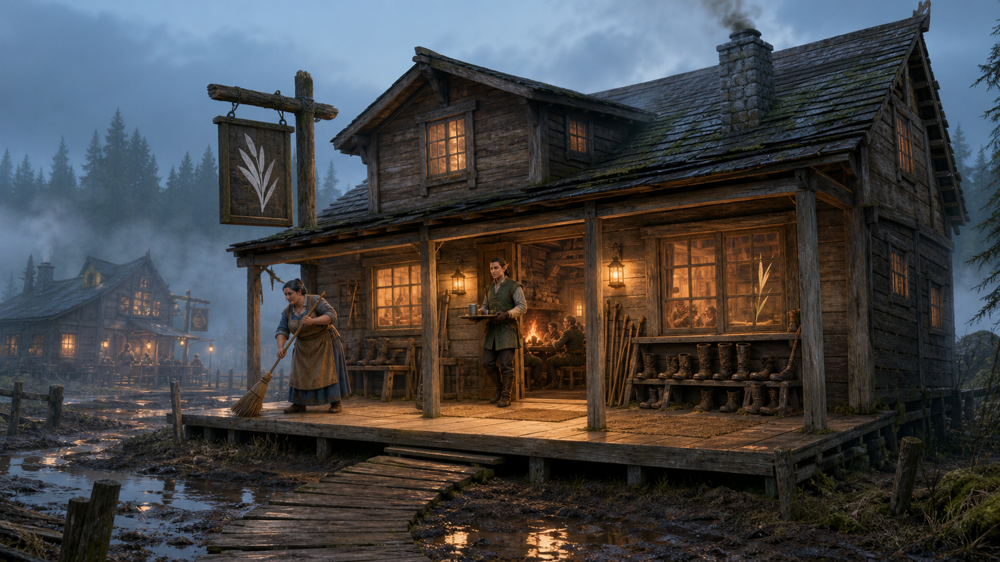

# Silver Reed

*A Lantern and Ledger guide to Willowfen's first inn, compiled from the settlement gazetteer, guest recollections, and the travel accounts of Velka of the Sootscale*

> The building leans, the rain comes sideways, and every chair has been repaired at least once. That's how you know the place belongs here.
>
> — Sorn Delvik

The Silver Reed is a cheerful two-story inn and tavern opposite Willowfen General at the center of Willowfen. Its porch is the driest public place in the settlement through relentless sweeping, careful drainage, and the refusal of its staff to recognize contrary evidence.

Owned by the half-elven innkeeper Sorn Delvik and anchored by the formidable barkeep Edda Fenlock, the Silver Reed provides lodging, meals, drink, news, music, and shelter to settlers and travelers heading between Thumpington and the deeper western woods. Muddy boots and bad singing are welcome. Arrogance is expected to wipe its feet.

  

### At a Glance

**Type:** Inn, tavern, eating house, and informal gathering place

**Location:** Central Willowfen, opposite Willowfen General

**Owner and Innkeeper:** Sorn Delvik

**Barkeep:** Edda Fenlock

**Known For:** A remarkably dry porch, an easterly tilt, stew, traveler stories, and indiscriminate hospitality toward muddy boots

**Clientele:** Settlers, loggers, trappers, fishers, merchants, builders, and westbound travelers

**Associated Person:** Velka of the Sootscale

**House Warning:** *Don't mind the slope; it's settling*

  

### The Inn across the Track

The Silver Reed stands at Willowfen's modest center, opposite the general store and within sight of the new town hall. Plank walks approach its porch from several directions, though none remain equally elevated after prolonged rain. Lanterns beneath its eaves glow through the basin's evening fog, making the inn one of the village's clearest landmarks.

The ground slopes gently southeast, and so does part of the building. Every owner, carpenter, surveyor, and drinking philosopher has expressed an opinion about whether this is harmless settling, a correctable flaw, or the structure sensibly preparing to leave. Sorn monitors the foundations, reinforces them when needed, and declines to close a profitable topic of conversation.

  

### History

Willowfen was founded on 3 Desnas 4713 AR by settlers who began building almost as soon as surveyors described the damp site as mostly stable. The Silver Reed opened before its construction was complete because Willowfen needed a common hearth sooner than it needed architectural dignity.

Minister Linzi's celebrated first visit occurred during this unfinished period. At the time, the inn possessed a roof, three walls, and a bar counter that performed additional duty as structural support. Edda Fenlock served the minister a tankard and advised her not to mind the slope. Spilled drinks reliably traveled to the same southeastern corner, forming what Linzi named *Republic Reserve*.

The missing wall was subsequently installed, a second story completed, and the bar relieved of most structural responsibilities. The inn remains slightly tilted. Edda maintains that correcting it completely would invalidate too many stories.

  

### The Building

  

#### The Dry Porch

The broad front porch is swept throughout the day and edged by narrow drainage channels leading toward a gravel bed. It is the preferred location for removing mud, exchanging quick news, and waiting to see whether rain intends to become weather.

Benches line the wall beneath the eaves. A rack holds walking sticks, boot scrapers, spare reed mats, and several pairs of wooden overshoes available to guests who do not mind looking sensible.

  

#### The Common Room

The common room contains a long bar, mismatched tables, a broad hearth, and a small corner platform for musicians or anyone too committed to a story to remain seated. The floor has been leveled in stages, producing a series of subtle corrections rather than a single reliable plane.

The southeastern corner retains a shallow copper basin where spilled drink once collected. Patrons still contribute a few drops from the final cup of an evening to the *Reserve*. Edda empties and scrubs the basin every morning because tradition, unlike mold, is welcome.

  

#### The Guest Floor

The upper story contains simple rooms with sturdy beds, pegs for wet clothes, lidded washbasins, and shutters that close tightly against mist and insects. Walls are thin enough to encourage reasonable quiet and thick enough that reasonable quiet is rarely achieved.

The best room faces the lantern-lit center of Willowfen. The least expensive rooms face the kitchen yard and are therefore the first to learn what breakfast will be. Travelers are told plainly which portions of the inn slope before receiving a key.

  

#### The Kitchen

The kitchen serves stew, grilled fish, game when trappers have been fortunate, coarse bread, root vegetables, and whatever fresh supplies Willowfen General received that week. A shipment heavy in turnips produces several days of culinary creativity followed by increasingly direct complaints.

Sorn's first well produced mud rather than drinking water. Velka blessed it with a prayer to Hanspur, and clear water ran by the following morning. The well is now covered, lined, and inspected after heavy rains. Whether the blessing or subsequent practical work deserves greater credit is not debated while Velka is cooking.

  

### Sorn Delvik

Sorn Delvik is the Silver Reed's half-elven owner and innkeeper. He possesses the enduring optimism required to build two stories upon Willowfen's ground and enough caution to check the supports afterward. His manner is calm, hospitable, and occasionally distracted by a leak that no one else has noticed yet.

Sorn oversees lodging, provisions, repairs, accounts, and the inn's relationship with caravan operators. He treats newcomers generously but expects every able resident to contribute when the village faces flood, fire, or structural trouble. The inn's common room has served as a meal station, work muster, and overflow shelter during difficult weather.

Velka is his unofficial partner in fortune. She helped restore confidence in the well, works in the kitchen when the inn is overwhelmed, and tells stories by the hearth. Sorn repays her in meals, a permanent room when available, and the freedom to rearrange his collection of river charms without asking.

  

### Edda Fenlock

Edda Fenlock runs the bar with the authority of someone who served customers while the counter was still holding up part of the building. She is direct, unflappable, and capable of filling a tankard while explaining why a patron's proposed construction shortcut will kill someone.

She remembers Linzi's first visit in detail and corrects retellings that make the inn appear more complete than it was. Her famous instruction—*Don't mind the slope; it's settling*—remains painted above the bar.

Edda welcomes muddy workers, tired travelers, poor singers, and lively disagreement. She removes bullies, deliberate cheats, anyone who threatens staff, and guests who mistake frontier hospitality for weakness.

  

### Velka at the Silver Reed

Velka came to Willowfen while the settlement still smelled entirely of new lumber and wet earth. She saw promise rather than incompleteness, saying that every settlement begins as a puddle and Willowfen merely remembers where it came from.

At the Silver Reed she helps cook, clean, carry water, entertain children, and welcome travelers whose courage has been reduced by the last miles of road. Children follow her through the village and race her driftwood boats along muddy drainage ditches. Their races often end at the inn's porch, where Edda judges winners according to criteria she changes whenever necessary.

Velka's presence has given the inn mild Hanspurite associations, but it is not a temple. Her blessing of the well is remembered through careful maintenance rather than a claim that sacred water cannot become contaminated. Sorn insists that gratitude to a river god is compatible with a tight lid and regular inspection.

  

### Food, Drink, and Entertainment

The Silver Reed serves plain frontier food in generous portions. Its menu changes with local catch, game, garden produce, and caravan deliveries. Stew is constant; its exact identity is negotiable. The house ale is light enough for workers expecting an early morning and strong enough to improve evening singing without improving its accuracy.

Music is usually provided by guests, local fiddlers, or workers with enough energy left to keep rhythm upon a table. Story nights collect accounts from trappers, fishers, caravan crews, and surveyors. Sorn records useful details about trails, water, wildlife, and ruined structures after separating them from the portions added for applause.

  

### Customs of the House

  

#### The Boot Line

Guests leave heavily muddied boots upon slatted racks inside the porch. Anyone taking the wrong pair must either return them promptly or accept the judgment of the common room. Spare wraps and wooden overshoes are available while footwear dries.

  

#### Republic Reserve

The final drops of an evening's cup may be poured into the copper basin at the southeast corner in memory of the inn's unfinished opening. The contribution is voluntary and small. Pouring an entire drink into it for dramatic effect earns the contributor a cleaning rag.

  

#### The Reed in the Window

A silver-gray reed is placed in the front window for every guest expected from the western trail before nightfall. If the traveler has not arrived by closing, the reed is moved beside the door and the watch or available searchers are notified.

  

#### The Dry-Step Wager

During Willowfen's fair-weather gatherings, patrons wager upon who can cross from Willowfen General to the Silver Reed without stepping into mud. Success is rare. Moving the planks after wagers have been placed is forbidden by both establishments and attempted annually.

  

### Place in Willowfen

The Silver Reed is Willowfen's evening counterpart to the general store. Willowfen General supplies material needs and daytime information; the inn supplies beds, hot food, drink, stories, and the companionship needed after building in wet ground since dawn.

It also embodies the settlement's growth. The three-walled public house became a completed two-story lodge without losing its humor, its slight tilt, or the memory of those who drank beneath an unfinished roof. Like Willowfen itself, it works before it is perfect and improves because people keep returning to the job.

At night, the inn's lanterns shine through mist while frogs and insects fill the basin with sound. For westbound travelers that light means they are not yet lost. For the people inside, it means home has stayed standing for another day.

  
> Willowfen doesn't ask whether you're important. It asks whether you're wet, hungry, and willing to help move a table when the floor changes its mind.
>
> — Edda Fenlock
